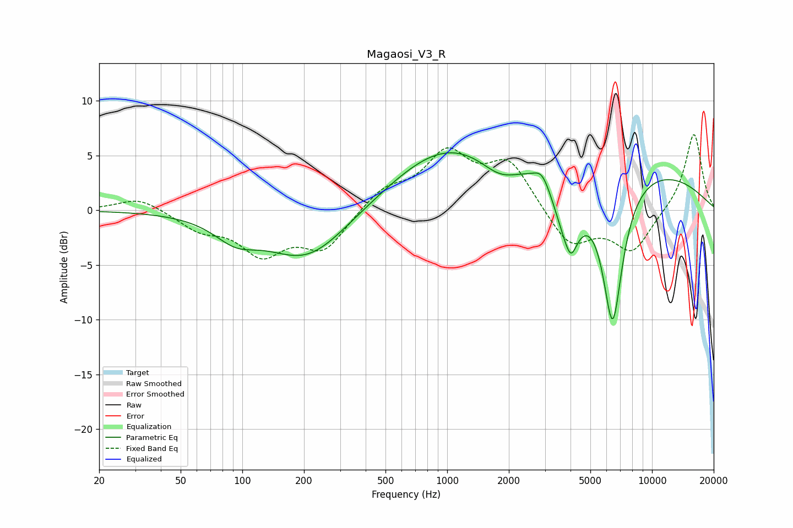

# Magaosi_V3_R
See [usage instructions](https://github.com/jaakkopasanen/AutoEq#usage) for more options and info.

### Parametric EQs
Apply preamp of -5.3 dB when using parametric equalizer.

|   # | Type    |   Fc (Hz) |    Q |   Gain (dB) |
|-----|---------|-----------|------|-------------|
|   1 | Peaking |        93 | 1.36 |        -1.8 |
|   2 | Peaking |       207 | 0.72 |        -4.6 |
|   3 | Peaking |       910 | 0.55 |         3.8 |
|   4 | Peaking |      1817 | 1.4  |        -2.1 |
|   5 | Peaking |      2912 | 3.6  |         1.4 |
|   6 | Peaking |      3891 | 1.99 |        -5.9 |
|   7 | Peaking |      4025 | 5.56 |        -1.4 |
|   8 | Peaking |      4870 | 0.19 |         4.7 |
|   9 | Peaking |      6298 | 2.75 |        -0.8 |
|  10 | Peaking |      6429 | 2.58 |       -13   |

### Fixed Band EQs
When using fixed band (also called graphic) equalizer, apply preamp of **-7.0 dB** (if available) and set gains manually with these parameters.

|   # | Type    |   Fc (Hz) |    Q |   Gain (dB) |
|-----|---------|-----------|------|-------------|
|   1 | Peaking |        31 | 1.41 |         1.2 |
|   2 | Peaking |        62 | 1.41 |        -1.6 |
|   3 | Peaking |       125 | 1.41 |        -3.7 |
|   4 | Peaking |       250 | 1.41 |        -3.4 |
|   5 | Peaking |       500 | 1.41 |         1.9 |
|   6 | Peaking |      1000 | 1.41 |         4.9 |
|   7 | Peaking |      2000 | 1.41 |         4.2 |
|   8 | Peaking |      4000 | 1.41 |        -3.4 |
|   9 | Peaking |      8000 | 1.41 |        -3.7 |
|  10 | Peaking |     16000 | 1.41 |         7.2 |

### Graphs

