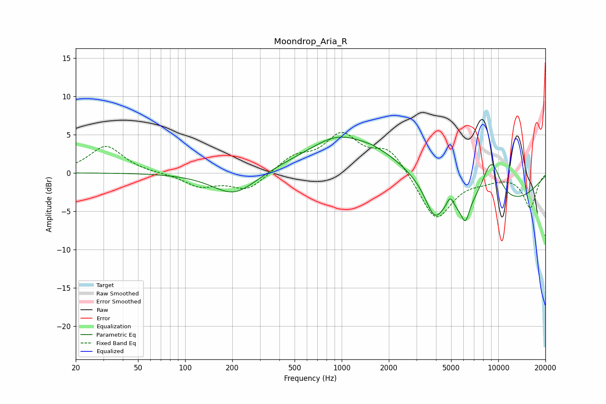

# Moondrop_Aria_R
See [usage instructions](https://github.com/jaakkopasanen/AutoEq#usage) for more options and info.

### Parametric EQs
Apply preamp of -4.8 dB when using parametric equalizer.

|   # | Type    |   Fc (Hz) |    Q |   Gain (dB) |
|-----|---------|-----------|------|-------------|
|   1 | Peaking |       206 | 1.01 |        -3.1 |
|   2 | Peaking |       904 | 1.13 |         1   |
|   3 | Peaking |      1469 | 0.39 |         5.4 |
|   4 | Peaking |      1566 | 5.55 |         0.1 |
|   5 | Peaking |      3904 | 2.46 |        -3.8 |
|   6 | Peaking |      4935 | 6    |         1.6 |
|   7 | Peaking |      5542 | 1.77 |        -1   |
|   8 | Peaking |      6169 | 5.3  |        -2.5 |
|   9 | Peaking |      7166 | 0.28 |        -5.4 |
|  10 | Peaking |      9025 | 1.99 |         6   |

### Fixed Band EQs
When using fixed band (also called graphic) equalizer, apply preamp of **-5.4 dB** (if available) and set gains manually with these parameters.

|   # | Type    |   Fc (Hz) |    Q |   Gain (dB) |
|-----|---------|-----------|------|-------------|
|   1 | Peaking |        31 | 1.41 |         3.5 |
|   2 | Peaking |        62 | 1.41 |        -0   |
|   3 | Peaking |       125 | 1.41 |        -1.7 |
|   4 | Peaking |       250 | 1.41 |        -2.2 |
|   5 | Peaking |       500 | 1.41 |         1.9 |
|   6 | Peaking |      1000 | 1.41 |         4.7 |
|   7 | Peaking |      2000 | 1.41 |         3.1 |
|   8 | Peaking |      4000 | 1.41 |        -6.3 |
|   9 | Peaking |      8000 | 1.41 |        -0.7 |
|  10 | Peaking |     16000 | 1.41 |        -4.5 |

### Graphs

