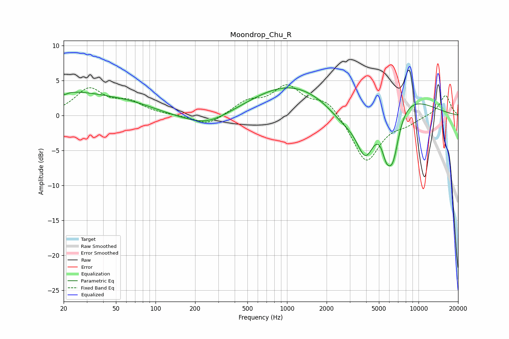

# Moondrop_Chu_R
See [usage instructions](https://github.com/jaakkopasanen/AutoEq#usage) for more options and info.

### Parametric EQs
Apply preamp of -4.0 dB when using parametric equalizer.

|   # | Type    |   Fc (Hz) |    Q |   Gain (dB) |
|-----|---------|-----------|------|-------------|
|   1 | Peaking |        20 | 5.93 |        -0.4 |
|   2 | Peaking |        22 | 0.4  |         3.3 |
|   3 | Peaking |        67 | 0.82 |         0.7 |
|   4 | Peaking |       244 | 0.82 |        -1.9 |
|   5 | Peaking |      1051 | 0.49 |         4.3 |
|   6 | Peaking |      2650 | 1.18 |        -2.1 |
|   7 | Peaking |      3949 | 1.91 |        -6.9 |
|   8 | Peaking |      5670 | 4.08 |        -3.1 |
|   9 | Peaking |      6366 | 2.65 |        -7.7 |
|  10 | Peaking |      6863 | 0.57 |         3.6 |

### Fixed Band EQs
When using fixed band (also called graphic) equalizer, apply preamp of **-4.5 dB** (if available) and set gains manually with these parameters.

|   # | Type    |   Fc (Hz) |    Q |   Gain (dB) |
|-----|---------|-----------|------|-------------|
|   1 | Peaking |        31 | 1.41 |         3.6 |
|   2 | Peaking |        62 | 1.41 |         1.7 |
|   3 | Peaking |       125 | 1.41 |        -0   |
|   4 | Peaking |       250 | 1.41 |        -1.5 |
|   5 | Peaking |       500 | 1.41 |         1.8 |
|   6 | Peaking |      1000 | 1.41 |         3.9 |
|   7 | Peaking |      2000 | 1.41 |         2.2 |
|   8 | Peaking |      4000 | 1.41 |        -6.8 |
|   9 | Peaking |      8000 | 1.41 |        -0.9 |
|  10 | Peaking |     16000 | 1.41 |         2.9 |

### Graphs

