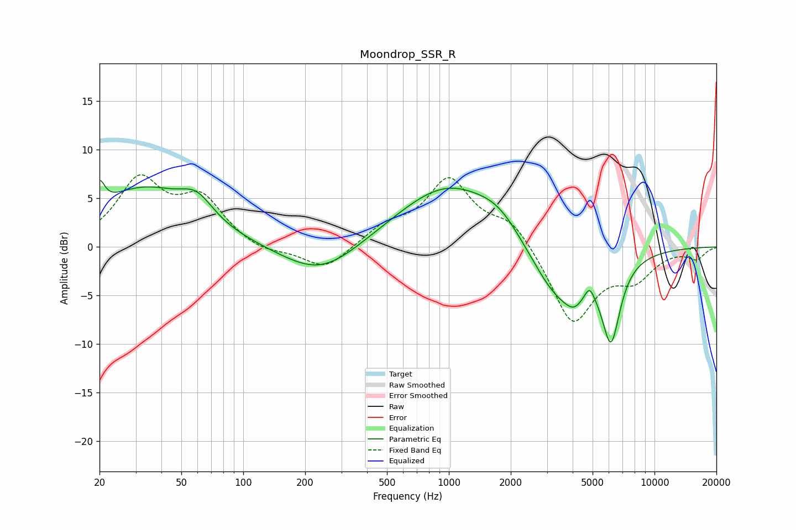

# Moondrop_SSR_R
See [usage instructions](https://github.com/jaakkopasanen/AutoEq#usage) for more options and info.

### Parametric EQs
Apply preamp of -6.9 dB when using parametric equalizer.

|   # | Type    |   Fc (Hz) |    Q |   Gain (dB) |
|-----|---------|-----------|------|-------------|
|   1 | Peaking |        20 | 5.93 |         2.5 |
|   2 | Peaking |        33 | 0.59 |         5.8 |
|   3 | Peaking |        59 | 1.83 |         2.3 |
|   4 | Peaking |       238 | 0.76 |        -3.3 |
|   5 | Peaking |       992 | 0.56 |         6.4 |
|   6 | Peaking |      1769 | 1.32 |         1.8 |
|   7 | Peaking |      3399 | 1    |        -6   |
|   8 | Peaking |      4076 | 3.03 |        -1.5 |
|   9 | Peaking |      4833 | 6    |         1.3 |
|  10 | Peaking |      6143 | 3.04 |        -8.2 |

### Fixed Band EQs
When using fixed band (also called graphic) equalizer, apply preamp of **-7.5 dB** (if available) and set gains manually with these parameters.

|   # | Type    |   Fc (Hz) |    Q |   Gain (dB) |
|-----|---------|-----------|------|-------------|
|   1 | Peaking |        31 | 1.41 |         6.6 |
|   2 | Peaking |        62 | 1.41 |         4.6 |
|   3 | Peaking |       125 | 1.41 |        -0.8 |
|   4 | Peaking |       250 | 1.41 |        -2.4 |
|   5 | Peaking |       500 | 1.41 |         1.8 |
|   6 | Peaking |      1000 | 1.41 |         6.7 |
|   7 | Peaking |      2000 | 1.41 |         2.6 |
|   8 | Peaking |      4000 | 1.41 |        -7.9 |
|   9 | Peaking |      8000 | 1.41 |        -2.8 |
|  10 | Peaking |     16000 | 1.41 |        -1.1 |

### Graphs

