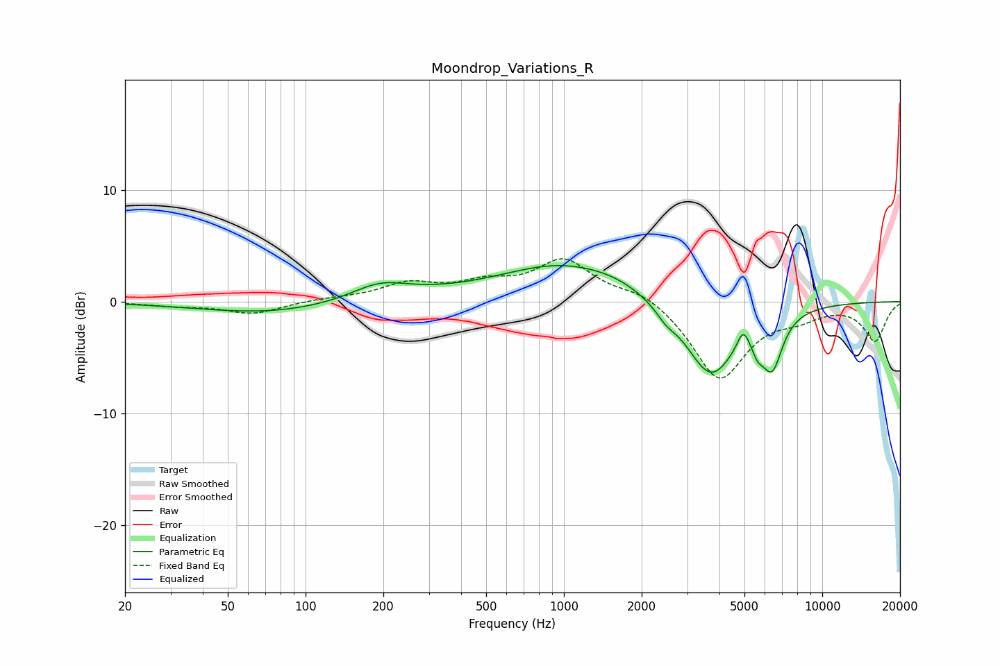

# Moondrop_Variations_R
See [usage instructions](https://github.com/jaakkopasanen/AutoEq#usage) for more options and info.

### Parametric EQs
Apply preamp of -3.3 dB when using parametric equalizer.

|   # | Type    |   Fc (Hz) |    Q |   Gain (dB) |
|-----|---------|-----------|------|-------------|
|   1 | Peaking |        72 | 0.52 |        -1.1 |
|   2 | Peaking |       193 | 1.3  |         1.4 |
|   3 | Peaking |       259 | 0.65 |         0.3 |
|   4 | Peaking |      1010 | 0.56 |         3.3 |
|   5 | Peaking |      1603 | 1.45 |         0.3 |
|   6 | Peaking |      2484 | 3.71 |        -0.8 |
|   7 | Peaking |      3698 | 1.42 |        -6.8 |
|   8 | Peaking |      4943 | 6    |         1.7 |
|   9 | Peaking |      5622 | 6    |        -1.3 |
|  10 | Peaking |      6396 | 3.39 |        -4.6 |

### Fixed Band EQs
When using fixed band (also called graphic) equalizer, apply preamp of **-3.9 dB** (if available) and set gains manually with these parameters.

|   # | Type    |   Fc (Hz) |    Q |   Gain (dB) |
|-----|---------|-----------|------|-------------|
|   1 | Peaking |        31 | 1.41 |        -0.3 |
|   2 | Peaking |        62 | 1.41 |        -1.1 |
|   3 | Peaking |       125 | 1.41 |         0.2 |
|   4 | Peaking |       250 | 1.41 |         1.5 |
|   5 | Peaking |       500 | 1.41 |         1.4 |
|   6 | Peaking |      1000 | 1.41 |         3.6 |
|   7 | Peaking |      2000 | 1.41 |         1.1 |
|   8 | Peaking |      4000 | 1.41 |        -7   |
|   9 | Peaking |      8000 | 1.41 |        -1   |
|  10 | Peaking |     16000 | 1.41 |        -3.5 |

### Graphs

