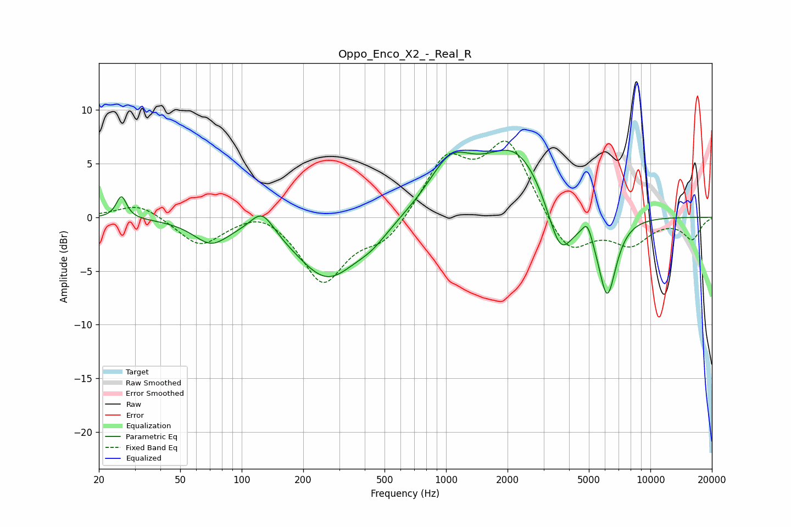

# Oppo_Enco_X2_-_Real_R
See [usage instructions](https://github.com/jaakkopasanen/AutoEq#usage) for more options and info.

### Parametric EQs
Apply preamp of -6.3 dB when using parametric equalizer.

|   # | Type    |   Fc (Hz) |    Q |   Gain (dB) |
|-----|---------|-----------|------|-------------|
|   1 | Peaking |        26 | 5.79 |         2.1 |
|   2 | Peaking |        71 | 1.66 |        -2.1 |
|   3 | Peaking |       126 | 2.43 |         2.2 |
|   4 | Peaking |       263 | 0.93 |        -5.7 |
|   5 | Peaking |       434 | 1.75 |        -1.1 |
|   6 | Peaking |      1050 | 1.31 |         4.4 |
|   7 | Peaking |      2207 | 0.87 |         6.3 |
|   8 | Peaking |      3618 | 2.14 |        -5.5 |
|   9 | Peaking |      4909 | 6    |         1.5 |
|  10 | Peaking |      6145 | 2.99 |        -7.6 |

### Fixed Band EQs
When using fixed band (also called graphic) equalizer, apply preamp of **-7.2 dB** (if available) and set gains manually with these parameters.

|   # | Type    |   Fc (Hz) |    Q |   Gain (dB) |
|-----|---------|-----------|------|-------------|
|   1 | Peaking |        31 | 1.41 |         1.4 |
|   2 | Peaking |        62 | 1.41 |        -2.7 |
|   3 | Peaking |       125 | 1.41 |         1.1 |
|   4 | Peaking |       250 | 1.41 |        -6   |
|   5 | Peaking |       500 | 1.41 |        -2.2 |
|   6 | Peaking |      1000 | 1.41 |         5.3 |
|   7 | Peaking |      2000 | 1.41 |         6.9 |
|   8 | Peaking |      4000 | 1.41 |        -3.7 |
|   9 | Peaking |      8000 | 1.41 |        -2.4 |
|  10 | Peaking |     16000 | 1.41 |        -2   |

### Graphs

