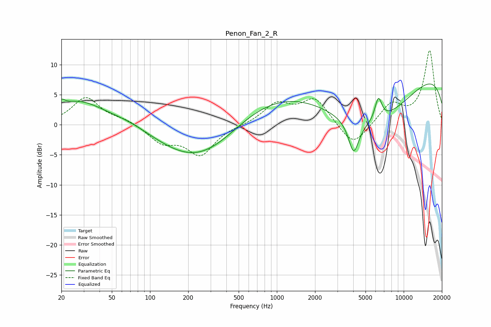

# Penon_Fan_2_R
See [usage instructions](https://github.com/jaakkopasanen/AutoEq#usage) for more options and info.

### Parametric EQs
Apply preamp of -6.9 dB when using parametric equalizer.

|   # | Type    |   Fc (Hz) |    Q |   Gain (dB) |
|-----|---------|-----------|------|-------------|
|   1 | Peaking |        20 | 5.37 |         1   |
|   2 | Peaking |        27 | 0.7  |         3.9 |
|   3 | Peaking |        68 | 0.77 |         1.1 |
|   4 | Peaking |       237 | 0.46 |        -6.5 |
|   5 | Peaking |       366 | 0.61 |        -1.2 |
|   6 | Peaking |       836 | 0.32 |         5.4 |
|   7 | Peaking |      4032 | 3.42 |        -5.4 |
|   8 | Peaking |      5621 | 0.38 |       -10   |
|   9 | Peaking |      6312 | 4.83 |         3.9 |
|  10 | Peaking |     10000 | 0.18 |        10.7 |

### Fixed Band EQs
When using fixed band (also called graphic) equalizer, apply preamp of **-12.4 dB** (if available) and set gains manually with these parameters.

|   # | Type    |   Fc (Hz) |    Q |   Gain (dB) |
|-----|---------|-----------|------|-------------|
|   1 | Peaking |        31 | 1.41 |         4.5 |
|   2 | Peaking |        62 | 1.41 |         0.8 |
|   3 | Peaking |       125 | 1.41 |        -2.8 |
|   4 | Peaking |       250 | 1.41 |        -4.8 |
|   5 | Peaking |       500 | 1.41 |        -0   |
|   6 | Peaking |      1000 | 1.41 |         3.3 |
|   7 | Peaking |      2000 | 1.41 |         4.3 |
|   8 | Peaking |      4000 | 1.41 |        -3.9 |
|   9 | Peaking |      8000 | 1.41 |         3.4 |
|  10 | Peaking |     16000 | 1.41 |        12.3 |

### Graphs

