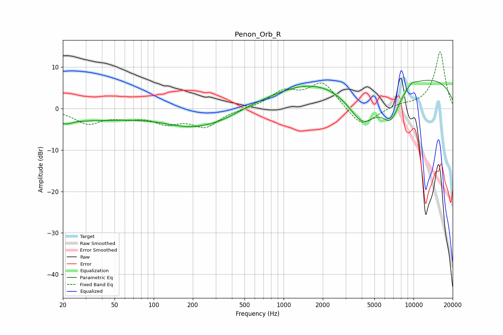

# Penon_Orb_R
See [usage instructions](https://github.com/jaakkopasanen/AutoEq#usage) for more options and info.

### Parametric EQs
Apply preamp of -6.9 dB when using parametric equalizer.

|   # | Type    |   Fc (Hz) |    Q |   Gain (dB) |
|-----|---------|-----------|------|-------------|
|   1 | Peaking |        21 | 3.26 |        -1   |
|   2 | Peaking |        26 | 0.33 |        -2.7 |
|   3 | Peaking |       206 | 0.61 |        -4.3 |
|   4 | Peaking |       358 | 1.3  |        -0.7 |
|   5 | Peaking |      1620 | 0.43 |         5.3 |
|   6 | Peaking |      2802 | 0.64 |        -0.2 |
|   7 | Peaking |      4052 | 1.1  |       -10.1 |
|   8 | Peaking |      6677 | 1.86 |        -7.4 |
|   9 | Peaking |      9638 | 3.29 |         1   |
|  10 | Peaking |     10000 | 0.22 |         7.8 |

### Fixed Band EQs
When using fixed band (also called graphic) equalizer, apply preamp of **-13.8 dB** (if available) and set gains manually with these parameters.

|   # | Type    |   Fc (Hz) |    Q |   Gain (dB) |
|-----|---------|-----------|------|-------------|
|   1 | Peaking |        31 | 1.41 |        -3.4 |
|   2 | Peaking |        62 | 1.41 |        -1.6 |
|   3 | Peaking |       125 | 1.41 |        -3   |
|   4 | Peaking |       250 | 1.41 |        -4.1 |
|   5 | Peaking |       500 | 1.41 |        -0.1 |
|   6 | Peaking |      1000 | 1.41 |         3.8 |
|   7 | Peaking |      2000 | 1.41 |         6.2 |
|   8 | Peaking |      4000 | 1.41 |        -4.8 |
|   9 | Peaking |      8000 | 1.41 |         0.8 |
|  10 | Peaking |     16000 | 1.41 |        13.8 |

### Graphs

