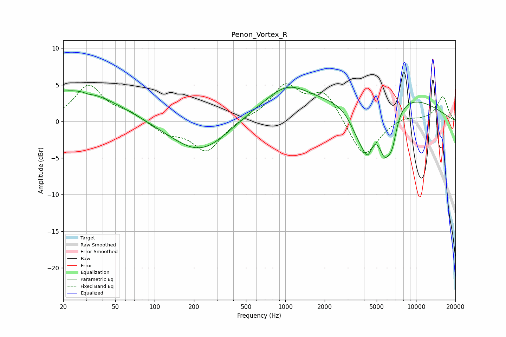

# Penon_Vortex_R
See [usage instructions](https://github.com/jaakkopasanen/AutoEq#usage) for more options and info.

### Parametric EQs
Apply preamp of -4.8 dB when using parametric equalizer.

|   # | Type    |   Fc (Hz) |    Q |   Gain (dB) |
|-----|---------|-----------|------|-------------|
|   1 | Peaking |        24 | 0.42 |         4.3 |
|   2 | Peaking |        31 | 5.09 |        -0.2 |
|   3 | Peaking |       229 | 0.61 |        -5.2 |
|   4 | Peaking |       484 | 0.44 |         1.6 |
|   5 | Peaking |      1039 | 0.84 |         3.4 |
|   6 | Peaking |      3738 | 1.71 |        -4.9 |
|   7 | Peaking |      4266 | 3.73 |        -3.2 |
|   8 | Peaking |      5711 | 0.33 |         4.3 |
|   9 | Peaking |      5788 | 2.52 |        -6.5 |
|  10 | Peaking |      6606 | 4.03 |        -2.9 |

### Fixed Band EQs
When using fixed band (also called graphic) equalizer, apply preamp of **-5.2 dB** (if available) and set gains manually with these parameters.

|   # | Type    |   Fc (Hz) |    Q |   Gain (dB) |
|-----|---------|-----------|------|-------------|
|   1 | Peaking |        31 | 1.41 |         4.8 |
|   2 | Peaking |        62 | 1.41 |         1   |
|   3 | Peaking |       125 | 1.41 |        -1.5 |
|   4 | Peaking |       250 | 1.41 |        -4.1 |
|   5 | Peaking |       500 | 1.41 |         0.4 |
|   6 | Peaking |      1000 | 1.41 |         4.7 |
|   7 | Peaking |      2000 | 1.41 |         3.9 |
|   8 | Peaking |      4000 | 1.41 |        -5.2 |
|   9 | Peaking |      8000 | 1.41 |         0.7 |
|  10 | Peaking |     16000 | 1.41 |         3.4 |

### Graphs

