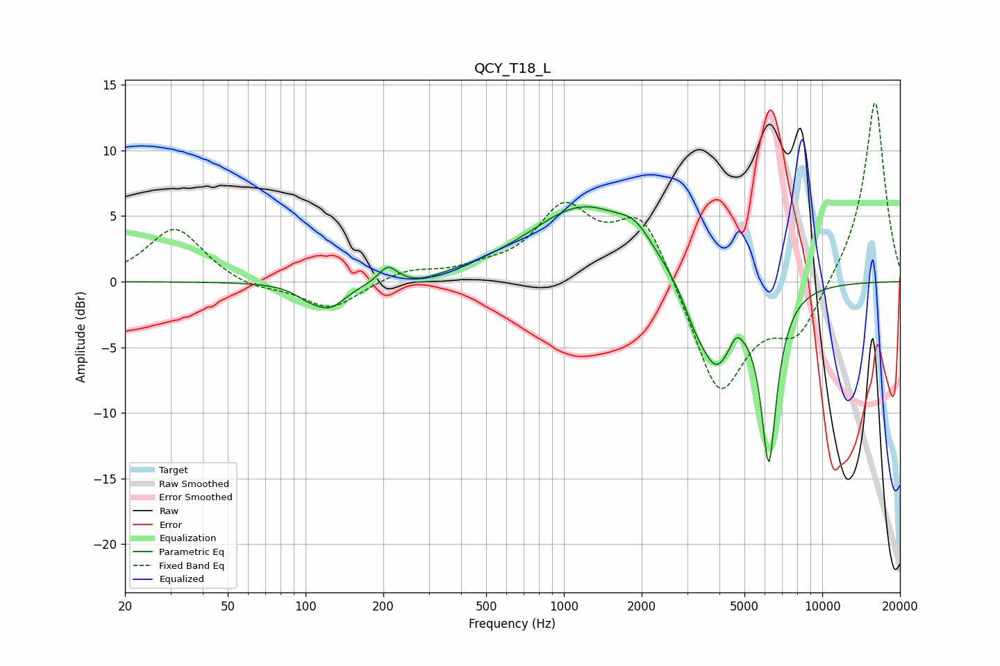

# QCY_T18_L
See [usage instructions](https://github.com/jaakkopasanen/AutoEq#usage) for more options and info.

### Parametric EQs
Apply preamp of -5.8 dB when using parametric equalizer.

|   # | Type    |   Fc (Hz) |    Q |   Gain (dB) |
|-----|---------|-----------|------|-------------|
|   1 | Peaking |       101 | 2.86 |        -0.5 |
|   2 | Peaking |       124 | 2.12 |        -1.9 |
|   3 | Peaking |       208 | 4.09 |         1.3 |
|   4 | Peaking |       277 | 1.71 |        -0.5 |
|   5 | Peaking |      1196 | 0.67 |         5.7 |
|   6 | Peaking |      1892 | 2.26 |         1.4 |
|   7 | Peaking |      3188 | 3.02 |        -1.4 |
|   8 | Peaking |      3881 | 1.97 |        -6.4 |
|   9 | Peaking |      4636 | 6    |         0.9 |
|  10 | Peaking |      6211 | 4.33 |       -13   |

### Fixed Band EQs
When using fixed band (also called graphic) equalizer, apply preamp of **-13.7 dB** (if available) and set gains manually with these parameters.

|   # | Type    |   Fc (Hz) |    Q |   Gain (dB) |
|-----|---------|-----------|------|-------------|
|   1 | Peaking |        31 | 1.41 |         4.2 |
|   2 | Peaking |        62 | 1.41 |        -0.6 |
|   3 | Peaking |       125 | 1.41 |        -2.1 |
|   4 | Peaking |       250 | 1.41 |         0.9 |
|   5 | Peaking |       500 | 1.41 |         0.6 |
|   6 | Peaking |      1000 | 1.41 |         5.3 |
|   7 | Peaking |      2000 | 1.41 |         5.3 |
|   8 | Peaking |      4000 | 1.41 |        -8.9 |
|   9 | Peaking |      8000 | 1.41 |        -3.9 |
|  10 | Peaking |     16000 | 1.41 |        14   |

### Graphs

