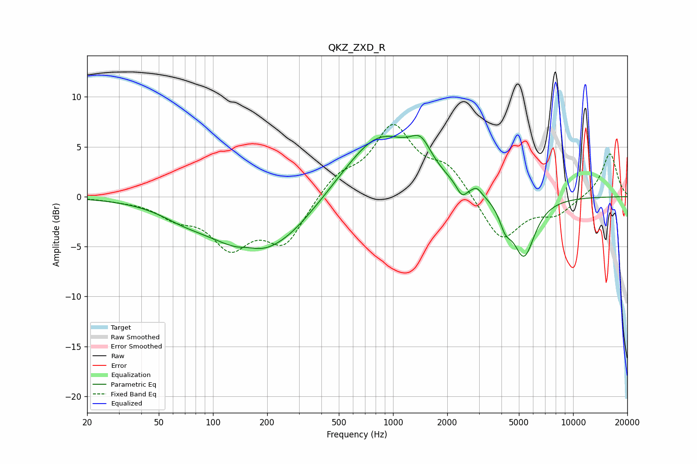

# QKZ_ZXD_R
See [usage instructions](https://github.com/jaakkopasanen/AutoEq#usage) for more options and info.

### Parametric EQs
Apply preamp of -6.2 dB when using parametric equalizer.

|   # | Type    |   Fc (Hz) |    Q |   Gain (dB) |
|-----|---------|-----------|------|-------------|
|   1 | Peaking |        69 | 1.14 |        -0.8 |
|   2 | Peaking |       157 | 2.83 |         0.4 |
|   3 | Peaking |       166 | 0.58 |        -5.2 |
|   4 | Peaking |       270 | 0.81 |        -1.2 |
|   5 | Peaking |       841 | 0.7  |         6.5 |
|   6 | Peaking |      1427 | 2.45 |         2.4 |
|   7 | Peaking |      2412 | 4.88 |        -1.3 |
|   8 | Peaking |      2915 | 5.63 |         0.6 |
|   9 | Peaking |      4207 | 4.22 |        -1.9 |
|  10 | Peaking |      5333 | 2.29 |        -6   |

### Fixed Band EQs
When using fixed band (also called graphic) equalizer, apply preamp of **-7.3 dB** (if available) and set gains manually with these parameters.

|   # | Type    |   Fc (Hz) |    Q |   Gain (dB) |
|-----|---------|-----------|------|-------------|
|   1 | Peaking |        31 | 1.41 |        -0.2 |
|   2 | Peaking |        62 | 1.41 |        -1.7 |
|   3 | Peaking |       125 | 1.41 |        -4.6 |
|   4 | Peaking |       250 | 1.41 |        -4.5 |
|   5 | Peaking |       500 | 1.41 |         2   |
|   6 | Peaking |      1000 | 1.41 |         6.7 |
|   7 | Peaking |      2000 | 1.41 |         2.8 |
|   8 | Peaking |      4000 | 1.41 |        -4.5 |
|   9 | Peaking |      8000 | 1.41 |        -1.6 |
|  10 | Peaking |     16000 | 1.41 |         4.4 |

### Graphs

