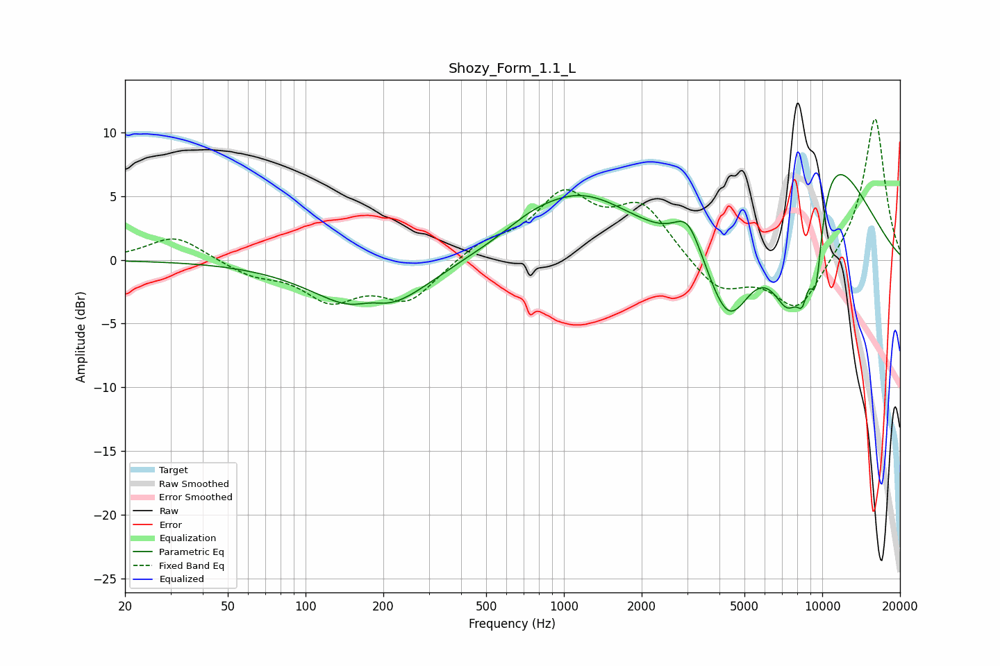

# Shozy_Form_1.1_L
See [usage instructions](https://github.com/jaakkopasanen/AutoEq#usage) for more options and info.

### Parametric EQs
Apply preamp of -6.8 dB when using parametric equalizer.

|   # | Type    |   Fc (Hz) |    Q |   Gain (dB) |
|-----|---------|-----------|------|-------------|
|   1 | Peaking |       178 | 2.14 |         1.1 |
|   2 | Peaking |       180 | 0.76 |        -4.8 |
|   3 | Peaking |       741 | 1.62 |         0.4 |
|   4 | Peaking |      1140 | 0.64 |         5.1 |
|   5 | Peaking |      3025 | 2.54 |         2.9 |
|   6 | Peaking |      4345 | 1.54 |        -6.9 |
|   7 | Peaking |      7442 | 1.75 |        -8.9 |
|   8 | Peaking |      8394 | 5.46 |        -3.2 |
|   9 | Peaking |      9440 | 4.82 |        -6.8 |
|  10 | Peaking |     10000 | 0.66 |        10.3 |

### Fixed Band EQs
When using fixed band (also called graphic) equalizer, apply preamp of **-11.2 dB** (if available) and set gains manually with these parameters.

|   # | Type    |   Fc (Hz) |    Q |   Gain (dB) |
|-----|---------|-----------|------|-------------|
|   1 | Peaking |        31 | 1.41 |         1.9 |
|   2 | Peaking |        62 | 1.41 |        -1   |
|   3 | Peaking |       125 | 1.41 |        -2.9 |
|   4 | Peaking |       250 | 1.41 |        -3.1 |
|   5 | Peaking |       500 | 1.41 |         1.2 |
|   6 | Peaking |      1000 | 1.41 |         4.8 |
|   7 | Peaking |      2000 | 1.41 |         4   |
|   8 | Peaking |      4000 | 1.41 |        -2.5 |
|   9 | Peaking |      8000 | 1.41 |        -4   |
|  10 | Peaking |     16000 | 1.41 |        11.3 |

### Graphs

