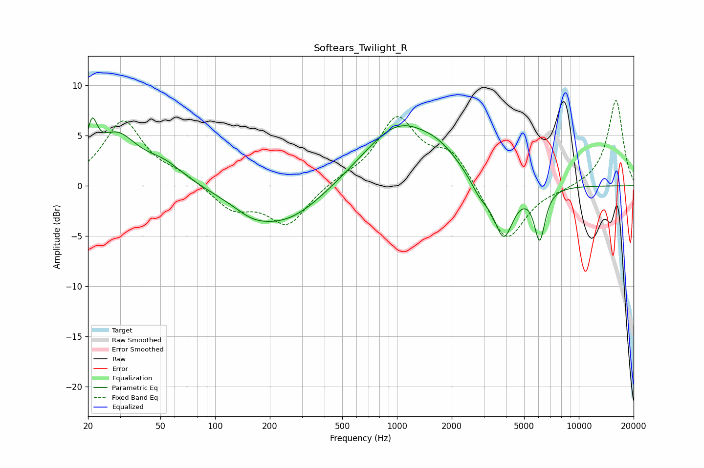

# Softears_Twilight_R
See [usage instructions](https://github.com/jaakkopasanen/AutoEq#usage) for more options and info.

### Parametric EQs
Apply preamp of -6.9 dB when using parametric equalizer.

|   # | Type    |   Fc (Hz) |    Q |   Gain (dB) |
|-----|---------|-----------|------|-------------|
|   1 | Peaking |        21 | 5.18 |         3.7 |
|   2 | Peaking |        29 | 1.24 |         4.7 |
|   3 | Peaking |        52 | 1.23 |         1.8 |
|   4 | Peaking |       158 | 1.59 |        -0.8 |
|   5 | Peaking |       237 | 0.64 |        -3.9 |
|   6 | Peaking |      1020 | 0.69 |         6.1 |
|   7 | Peaking |      1713 | 1.32 |         1.3 |
|   8 | Peaking |      2879 | 2.46 |        -1.6 |
|   9 | Peaking |      3860 | 2.64 |        -5.4 |
|  10 | Peaking |      6090 | 4.62 |        -5.1 |

### Fixed Band EQs
When using fixed band (also called graphic) equalizer, apply preamp of **-8.6 dB** (if available) and set gains manually with these parameters.

|   # | Type    |   Fc (Hz) |    Q |   Gain (dB) |
|-----|---------|-----------|------|-------------|
|   1 | Peaking |        31 | 1.41 |         6.4 |
|   2 | Peaking |        62 | 1.41 |         0.9 |
|   3 | Peaking |       125 | 1.41 |        -2.3 |
|   4 | Peaking |       250 | 1.41 |        -3.9 |
|   5 | Peaking |       500 | 1.41 |         0.6 |
|   6 | Peaking |      1000 | 1.41 |         6.6 |
|   7 | Peaking |      2000 | 1.41 |         3.2 |
|   8 | Peaking |      4000 | 1.41 |        -5.9 |
|   9 | Peaking |      8000 | 1.41 |        -0.3 |
|  10 | Peaking |     16000 | 1.41 |         8.6 |

### Graphs

