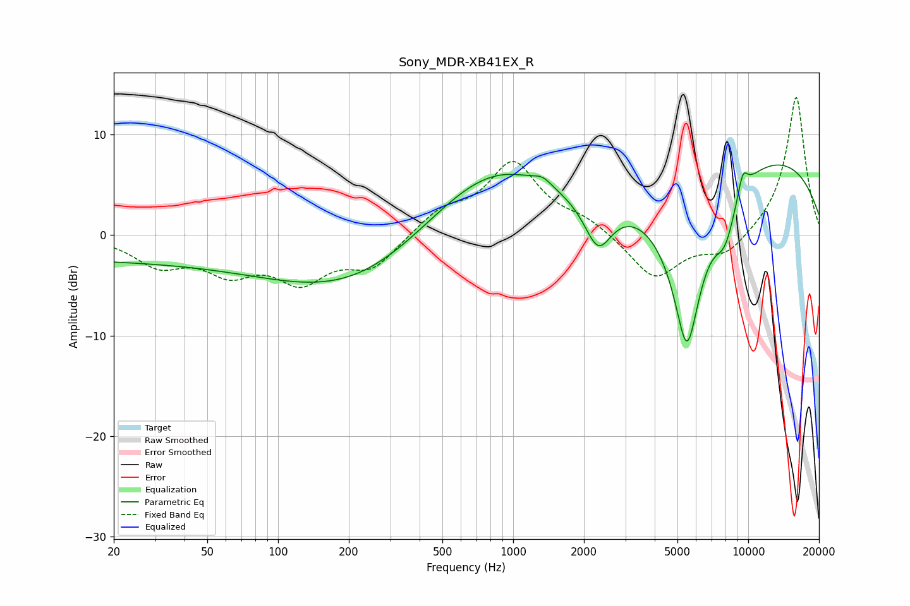

# Sony_MDR-XB41EX_R
See [usage instructions](https://github.com/jaakkopasanen/AutoEq#usage) for more options and info.

### Parametric EQs
Apply preamp of -7.1 dB when using parametric equalizer.

|   # | Type    |   Fc (Hz) |    Q |   Gain (dB) |
|-----|---------|-----------|------|-------------|
|   1 | Peaking |        22 | 0.18 |        -2.4 |
|   2 | Peaking |       210 | 0.42 |        -4.9 |
|   3 | Peaking |       557 | 0.61 |         1.9 |
|   4 | Peaking |       892 | 0.58 |         5.4 |
|   5 | Peaking |      1336 | 3.61 |         0.8 |
|   6 | Peaking |      2299 | 2.39 |        -4.9 |
|   7 | Peaking |      5487 | 1.81 |       -17.5 |
|   8 | Peaking |      7968 | 2.78 |        -4   |
|   9 | Peaking |      9483 | 6    |         2.1 |
|  10 | Peaking |     10000 | 0.24 |         8.5 |

### Fixed Band EQs
When using fixed band (also called graphic) equalizer, apply preamp of **-13.8 dB** (if available) and set gains manually with these parameters.

|   # | Type    |   Fc (Hz) |    Q |   Gain (dB) |
|-----|---------|-----------|------|-------------|
|   1 | Peaking |        31 | 1.41 |        -2.7 |
|   2 | Peaking |        62 | 1.41 |        -3.2 |
|   3 | Peaking |       125 | 1.41 |        -4.1 |
|   4 | Peaking |       250 | 1.41 |        -3.1 |
|   5 | Peaking |       500 | 1.41 |         2.2 |
|   6 | Peaking |      1000 | 1.41 |         7   |
|   7 | Peaking |      2000 | 1.41 |         1.3 |
|   8 | Peaking |      4000 | 1.41 |        -4.4 |
|   9 | Peaking |      8000 | 1.41 |        -2.1 |
|  10 | Peaking |     16000 | 1.41 |        14   |

### Graphs

