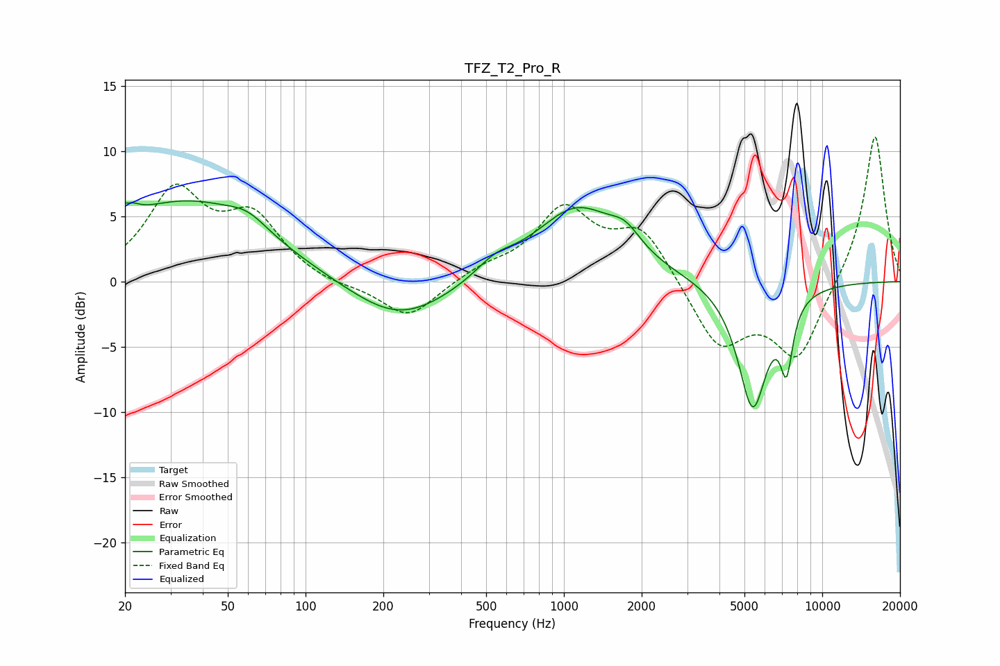

# TFZ_T2_Pro_R
See [usage instructions](https://github.com/jaakkopasanen/AutoEq#usage) for more options and info.

### Parametric EQs
Apply preamp of -6.3 dB when using parametric equalizer.

|   # | Type    |   Fc (Hz) |    Q |   Gain (dB) |
|-----|---------|-----------|------|-------------|
|   1 | Peaking |        20 | 4.66 |         3.8 |
|   2 | Peaking |        20 | 5.98 |        -2.5 |
|   3 | Peaking |        35 | 0.47 |         6   |
|   4 | Peaking |        60 | 1.84 |         1.1 |
|   5 | Peaking |       230 | 0.73 |        -3.2 |
|   6 | Peaking |       540 | 1.88 |         1.1 |
|   7 | Peaking |      1121 | 0.87 |         5.6 |
|   8 | Peaking |      1728 | 2.36 |         1.5 |
|   9 | Peaking |      5379 | 2.37 |        -9.6 |
|  10 | Peaking |      7275 | 5.6  |        -4.8 |

### Fixed Band EQs
When using fixed band (also called graphic) equalizer, apply preamp of **-11.2 dB** (if available) and set gains manually with these parameters.

|   # | Type    |   Fc (Hz) |    Q |   Gain (dB) |
|-----|---------|-----------|------|-------------|
|   1 | Peaking |        31 | 1.41 |         6.6 |
|   2 | Peaking |        62 | 1.41 |         4.5 |
|   3 | Peaking |       125 | 1.41 |        -0.4 |
|   4 | Peaking |       250 | 1.41 |        -2.9 |
|   5 | Peaking |       500 | 1.41 |         0.9 |
|   6 | Peaking |      1000 | 1.41 |         5.3 |
|   7 | Peaking |      2000 | 1.41 |         3.9 |
|   8 | Peaking |      4000 | 1.41 |        -5   |
|   9 | Peaking |      8000 | 1.41 |        -5.8 |
|  10 | Peaking |     16000 | 1.41 |        11.5 |

### Graphs

