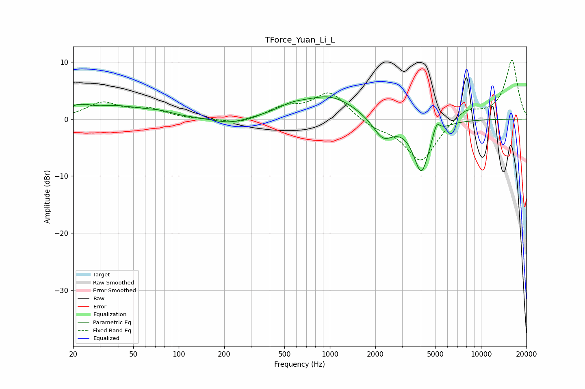

# TForce_Yuan_Li_L
See [usage instructions](https://github.com/jaakkopasanen/AutoEq#usage) for more options and info.

### Parametric EQs
Apply preamp of -4.0 dB when using parametric equalizer.

|   # | Type    |   Fc (Hz) |    Q |   Gain (dB) |
|-----|---------|-----------|------|-------------|
|   1 | Peaking |        22 | 3.18 |         2.5 |
|   2 | Peaking |        23 | 4.99 |        -1.2 |
|   3 | Peaking |        38 | 0.74 |         2.1 |
|   4 | Peaking |        75 | 1.62 |         0.6 |
|   5 | Peaking |       219 | 1.29 |        -1   |
|   6 | Peaking |       554 | 1.43 |         1.2 |
|   7 | Peaking |      1004 | 0.8  |         3.9 |
|   8 | Peaking |      2246 | 2.05 |        -3.8 |
|   9 | Peaking |      4031 | 2.62 |        -9.2 |
|  10 | Peaking |      5075 | 6    |         2.3 |

### Fixed Band EQs
When using fixed band (also called graphic) equalizer, apply preamp of **-10.4 dB** (if available) and set gains manually with these parameters.

|   # | Type    |   Fc (Hz) |    Q |   Gain (dB) |
|-----|---------|-----------|------|-------------|
|   1 | Peaking |        31 | 1.41 |         2.7 |
|   2 | Peaking |        62 | 1.41 |         1.6 |
|   3 | Peaking |       125 | 1.41 |        -0.1 |
|   4 | Peaking |       250 | 1.41 |        -0.9 |
|   5 | Peaking |       500 | 1.41 |         1.9 |
|   6 | Peaking |      1000 | 1.41 |         4.7 |
|   7 | Peaking |      2000 | 1.41 |        -1.3 |
|   8 | Peaking |      4000 | 1.41 |        -7.5 |
|   9 | Peaking |      8000 | 1.41 |         2   |
|  10 | Peaking |     16000 | 1.41 |        10.4 |

### Graphs

