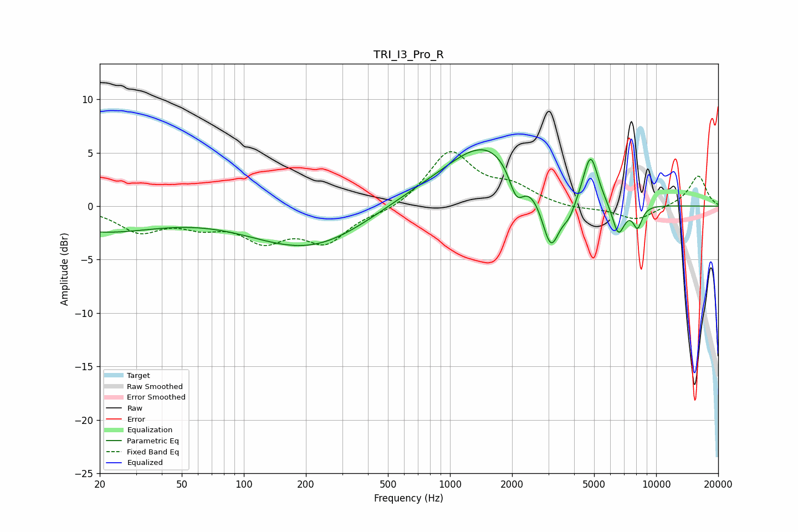

# TRI_I3_Pro_R
See [usage instructions](https://github.com/jaakkopasanen/AutoEq#usage) for more options and info.

### Parametric EQs
Apply preamp of -5.4 dB when using parametric equalizer.

|   # | Type    |   Fc (Hz) |    Q |   Gain (dB) |
|-----|---------|-----------|------|-------------|
|   1 | Peaking |        20 | 0.48 |        -2.3 |
|   2 | Peaking |       222 | 0.47 |        -4.4 |
|   3 | Peaking |       623 | 0.43 |         1.6 |
|   4 | Peaking |      1525 | 0.75 |         5.3 |
|   5 | Peaking |      2103 | 3.83 |        -2.9 |
|   6 | Peaking |      3084 | 3.17 |        -5.5 |
|   7 | Peaking |      3779 | 4.11 |        -1.5 |
|   8 | Peaking |      4808 | 3.94 |         4.6 |
|   9 | Peaking |      6556 | 4.4  |        -3.1 |
|  10 | Peaking |      8126 | 6    |        -2   |

### Fixed Band EQs
When using fixed band (also called graphic) equalizer, apply preamp of **-5.2 dB** (if available) and set gains manually with these parameters.

|   # | Type    |   Fc (Hz) |    Q |   Gain (dB) |
|-----|---------|-----------|------|-------------|
|   1 | Peaking |        31 | 1.41 |        -2.2 |
|   2 | Peaking |        62 | 1.41 |        -1.4 |
|   3 | Peaking |       125 | 1.41 |        -2.8 |
|   4 | Peaking |       250 | 1.41 |        -3.1 |
|   5 | Peaking |       500 | 1.41 |        -0.6 |
|   6 | Peaking |      1000 | 1.41 |         5.1 |
|   7 | Peaking |      2000 | 1.41 |         1.6 |
|   8 | Peaking |      4000 | 1.41 |        -0.3 |
|   9 | Peaking |      8000 | 1.41 |        -1.3 |
|  10 | Peaking |     16000 | 1.41 |         2.9 |

### Graphs

