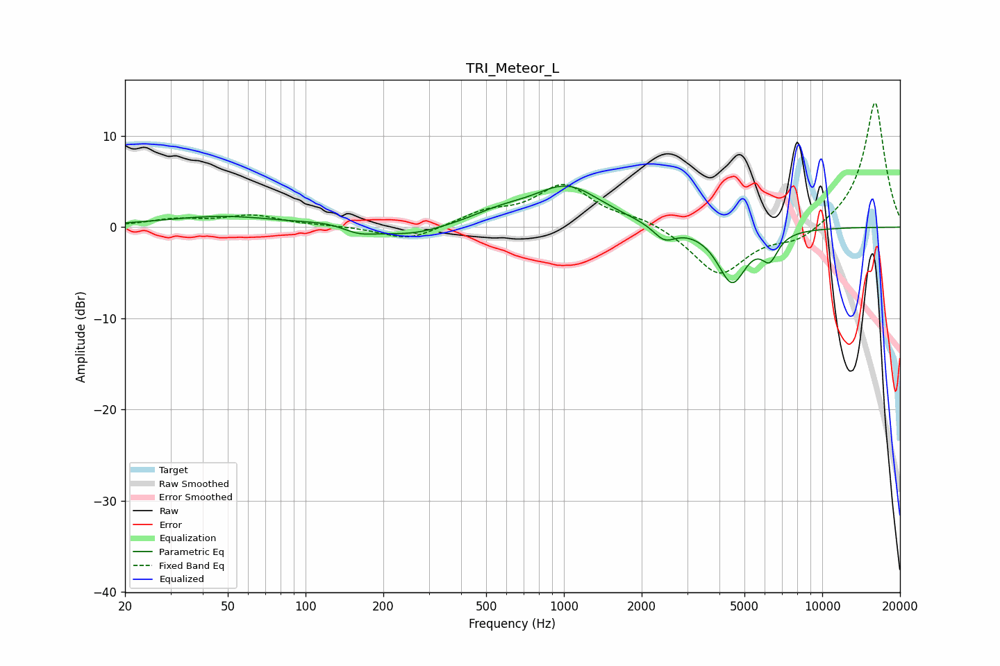

# TRI_Meteor_L
See [usage instructions](https://github.com/jaakkopasanen/AutoEq#usage) for more options and info.

### Parametric EQs
Apply preamp of -4.6 dB when using parametric equalizer.

|   # | Type    |   Fc (Hz) |    Q |   Gain (dB) |
|-----|---------|-----------|------|-------------|
|   1 | Peaking |        48 | 0.63 |         1.2 |
|   2 | Peaking |       124 | 1.6  |         0.4 |
|   3 | Peaking |       161 | 2.15 |        -0.8 |
|   4 | Peaking |       256 | 1.07 |        -1.1 |
|   5 | Peaking |       565 | 1.22 |         1.1 |
|   6 | Peaking |      1031 | 1.06 |         4.3 |
|   7 | Peaking |      2449 | 3.23 |        -1.7 |
|   8 | Peaking |      4472 | 3.41 |         0.4 |
|   9 | Peaking |      4475 | 2.54 |        -6.4 |
|  10 | Peaking |      6266 | 4.35 |        -2.6 |

### Fixed Band EQs
When using fixed band (also called graphic) equalizer, apply preamp of **-13.7 dB** (if available) and set gains manually with these parameters.

|   # | Type    |   Fc (Hz) |    Q |   Gain (dB) |
|-----|---------|-----------|------|-------------|
|   1 | Peaking |        31 | 1.41 |         0.8 |
|   2 | Peaking |        62 | 1.41 |         1.2 |
|   3 | Peaking |       125 | 1.41 |         0.1 |
|   4 | Peaking |       250 | 1.41 |        -1.5 |
|   5 | Peaking |       500 | 1.41 |         1.4 |
|   6 | Peaking |      1000 | 1.41 |         4.5 |
|   7 | Peaking |      2000 | 1.41 |         0.9 |
|   8 | Peaking |      4000 | 1.41 |        -5.3 |
|   9 | Peaking |      8000 | 1.41 |        -1.5 |
|  10 | Peaking |     16000 | 1.41 |        13.8 |

### Graphs

