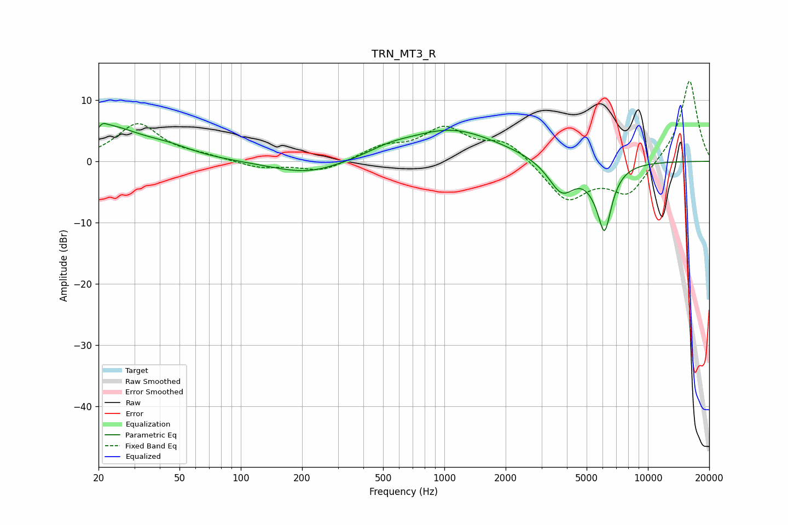

# TRN_MT3_R
See [usage instructions](https://github.com/jaakkopasanen/AutoEq#usage) for more options and info.

### Parametric EQs
Apply preamp of -6.3 dB when using parametric equalizer.

|   # | Type    |   Fc (Hz) |    Q |   Gain (dB) |
|-----|---------|-----------|------|-------------|
|   1 | Peaking |        20 | 6    |        -3.3 |
|   2 | Peaking |        20 | 5.92 |         3.2 |
|   3 | Peaking |        21 | 0.81 |         5.5 |
|   4 | Peaking |        44 | 1.18 |         1.1 |
|   5 | Peaking |       214 | 0.8  |        -2.3 |
|   6 | Peaking |       537 | 1.5  |         0.8 |
|   7 | Peaking |      1077 | 0.6  |         5.2 |
|   8 | Peaking |      3773 | 2.07 |        -5.4 |
|   9 | Peaking |      5374 | 3.02 |        -0.9 |
|  10 | Peaking |      6121 | 3.77 |       -10.3 |

### Fixed Band EQs
When using fixed band (also called graphic) equalizer, apply preamp of **-13.2 dB** (if available) and set gains manually with these parameters.

|   # | Type    |   Fc (Hz) |    Q |   Gain (dB) |
|-----|---------|-----------|------|-------------|
|   1 | Peaking |        31 | 1.41 |         6.1 |
|   2 | Peaking |        62 | 1.41 |         0.7 |
|   3 | Peaking |       125 | 1.41 |        -1.1 |
|   4 | Peaking |       250 | 1.41 |        -1.7 |
|   5 | Peaking |       500 | 1.41 |         2.1 |
|   6 | Peaking |      1000 | 1.41 |         5.1 |
|   7 | Peaking |      2000 | 1.41 |         3.3 |
|   8 | Peaking |      4000 | 1.41 |        -6.4 |
|   9 | Peaking |      8000 | 1.41 |        -5.3 |
|  10 | Peaking |     16000 | 1.41 |        13.5 |

### Graphs

