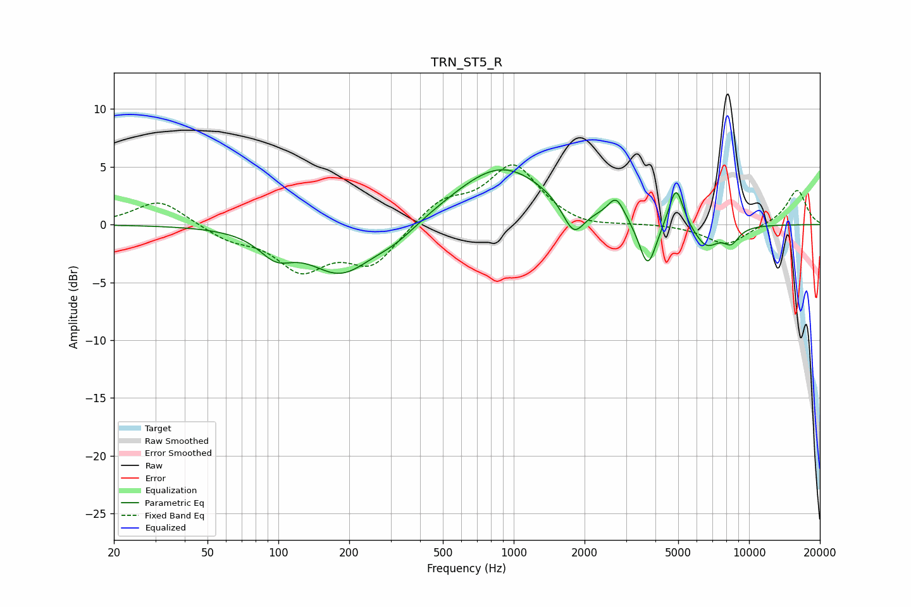

# TRN_ST5_R
See [usage instructions](https://github.com/jaakkopasanen/AutoEq#usage) for more options and info.

### Parametric EQs
Apply preamp of -4.8 dB when using parametric equalizer.

|   # | Type    |   Fc (Hz) |    Q |   Gain (dB) |
|-----|---------|-----------|------|-------------|
|   1 | Peaking |        98 | 1.96 |        -1.9 |
|   2 | Peaking |       184 | 1.04 |        -4.1 |
|   3 | Peaking |       315 | 1.42 |        -1.1 |
|   4 | Peaking |       888 | 0.7  |         5.1 |
|   5 | Peaking |      1798 | 3.05 |        -2.8 |
|   6 | Peaking |      2727 | 4.06 |         1.9 |
|   7 | Peaking |      3712 | 3.83 |        -4.1 |
|   8 | Peaking |      4895 | 4.53 |         3.7 |
|   9 | Peaking |      6582 | 2.51 |        -1.9 |
|  10 | Peaking |      8401 | 3.84 |        -1.3 |

### Fixed Band EQs
When using fixed band (also called graphic) equalizer, apply preamp of **-5.3 dB** (if available) and set gains manually with these parameters.

|   # | Type    |   Fc (Hz) |    Q |   Gain (dB) |
|-----|---------|-----------|------|-------------|
|   1 | Peaking |        31 | 1.41 |         2.2 |
|   2 | Peaking |        62 | 1.41 |        -1.1 |
|   3 | Peaking |       125 | 1.41 |        -3.6 |
|   4 | Peaking |       250 | 1.41 |        -3.4 |
|   5 | Peaking |       500 | 1.41 |         2   |
|   6 | Peaking |      1000 | 1.41 |         5   |
|   7 | Peaking |      2000 | 1.41 |        -0.5 |
|   8 | Peaking |      4000 | 1.41 |         0   |
|   9 | Peaking |      8000 | 1.41 |        -1.8 |
|  10 | Peaking |     16000 | 1.41 |         3   |

### Graphs

