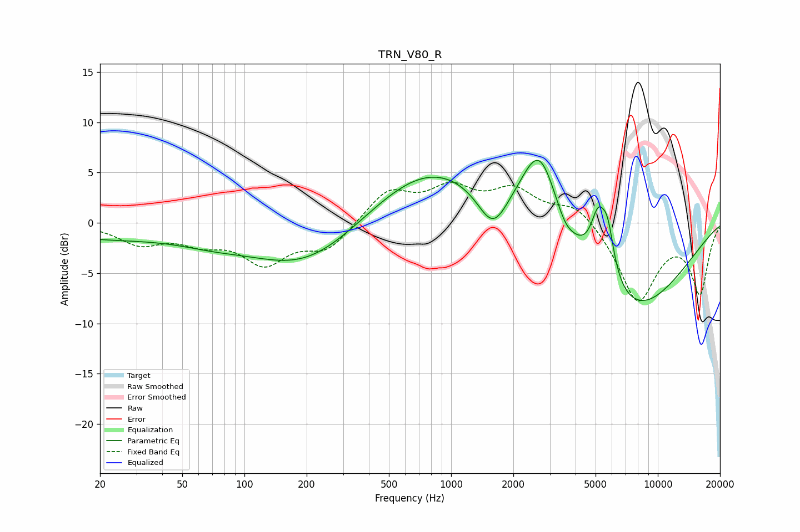

# TRN_V80_R
See [usage instructions](https://github.com/jaakkopasanen/AutoEq#usage) for more options and info.

### Parametric EQs
Apply preamp of -6.3 dB when using parametric equalizer.

|   # | Type    |   Fc (Hz) |    Q |   Gain (dB) |
|-----|---------|-----------|------|-------------|
|   1 | Peaking |        20 | 0.38 |        -1.4 |
|   2 | Peaking |        69 | 0.83 |        -0.8 |
|   3 | Peaking |       200 | 0.53 |        -4.6 |
|   4 | Peaking |       798 | 0.48 |         5.9 |
|   5 | Peaking |      1594 | 1.91 |        -4.2 |
|   6 | Peaking |      2680 | 1.49 |         8.5 |
|   7 | Peaking |      3552 | 3.33 |        -1.1 |
|   8 | Peaking |      5156 | 3.62 |         5.3 |
|   9 | Peaking |      5733 | 4.58 |         4.1 |
|  10 | Peaking |      7431 | 0.48 |        -9   |

### Fixed Band EQs
When using fixed band (also called graphic) equalizer, apply preamp of **-4.1 dB** (if available) and set gains manually with these parameters.

|   # | Type    |   Fc (Hz) |    Q |   Gain (dB) |
|-----|---------|-----------|------|-------------|
|   1 | Peaking |        31 | 1.41 |        -1.9 |
|   2 | Peaking |        62 | 1.41 |        -1.6 |
|   3 | Peaking |       125 | 1.41 |        -3.7 |
|   4 | Peaking |       250 | 1.41 |        -2.6 |
|   5 | Peaking |       500 | 1.41 |         3.1 |
|   6 | Peaking |      1000 | 1.41 |         3   |
|   7 | Peaking |      2000 | 1.41 |         3   |
|   8 | Peaking |      4000 | 1.41 |         2   |
|   9 | Peaking |      8000 | 1.41 |        -7.8 |
|  10 | Peaking |     16000 | 1.41 |        -6.8 |

### Graphs

