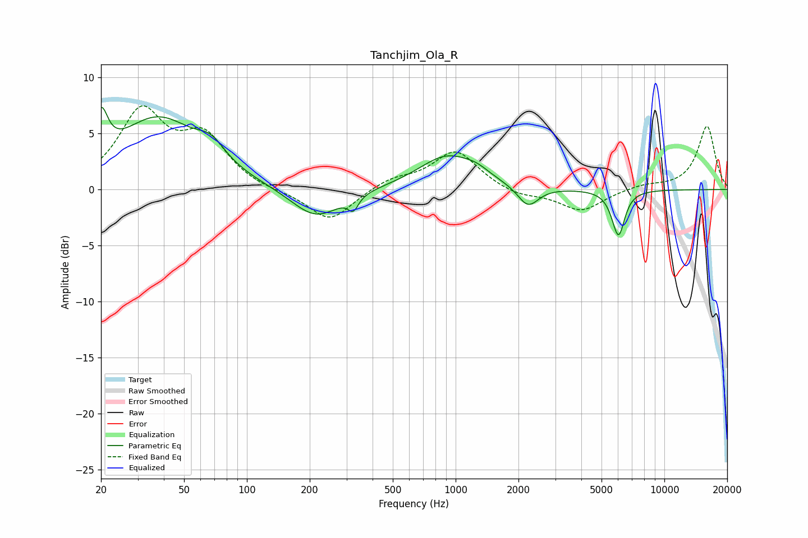

# Tanchjim_Ola_R
See [usage instructions](https://github.com/jaakkopasanen/AutoEq#usage) for more options and info.

### Parametric EQs
Apply preamp of -7.4 dB when using parametric equalizer.

|   # | Type    |   Fc (Hz) |    Q |   Gain (dB) |
|-----|---------|-----------|------|-------------|
|   1 | Peaking |        20 | 4.53 |         4   |
|   2 | Peaking |        37 | 0.71 |         6.3 |
|   3 | Peaking |        68 | 2.15 |         1.6 |
|   4 | Peaking |       214 | 1.2  |        -2.7 |
|   5 | Peaking |       323 | 5.96 |        -1.2 |
|   6 | Peaking |       909 | 1.03 |         3   |
|   7 | Peaking |      1259 | 2.3  |         0.6 |
|   8 | Peaking |      2223 | 2.84 |        -1.9 |
|   9 | Peaking |      5862 | 3.86 |        -0.9 |
|  10 | Peaking |      6052 | 4.9  |        -3.2 |

### Fixed Band EQs
When using fixed band (also called graphic) equalizer, apply preamp of **-7.6 dB** (if available) and set gains manually with these parameters.

|   # | Type    |   Fc (Hz) |    Q |   Gain (dB) |
|-----|---------|-----------|------|-------------|
|   1 | Peaking |        31 | 1.41 |         6.7 |
|   2 | Peaking |        62 | 1.41 |         4.3 |
|   3 | Peaking |       125 | 1.41 |        -0.2 |
|   4 | Peaking |       250 | 1.41 |        -2.9 |
|   5 | Peaking |       500 | 1.41 |         0.9 |
|   6 | Peaking |      1000 | 1.41 |         3.4 |
|   7 | Peaking |      2000 | 1.41 |        -0.6 |
|   8 | Peaking |      4000 | 1.41 |        -1.9 |
|   9 | Peaking |      8000 | 1.41 |         0.4 |
|  10 | Peaking |     16000 | 1.41 |         5.7 |

### Graphs

