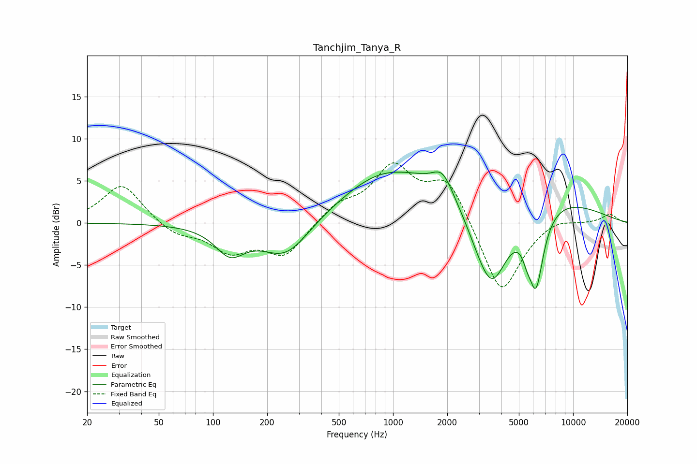

# Tanchjim_Tanya_R
See [usage instructions](https://github.com/jaakkopasanen/AutoEq#usage) for more options and info.

### Parametric EQs
Apply preamp of -6.2 dB when using parametric equalizer.

|   # | Type    |   Fc (Hz) |    Q |   Gain (dB) |
|-----|---------|-----------|------|-------------|
|   1 | Peaking |       124 | 1.73 |        -3.2 |
|   2 | Peaking |       255 | 1.02 |        -4.6 |
|   3 | Peaking |       339 | 0.84 |         0.3 |
|   4 | Peaking |       822 | 0.68 |         2.6 |
|   5 | Peaking |      1885 | 2.58 |         2.4 |
|   6 | Peaking |      2874 | 0.23 |         6.1 |
|   7 | Peaking |      2998 | 1.59 |        -1.7 |
|   8 | Peaking |      3550 | 1.31 |       -11.2 |
|   9 | Peaking |      5530 | 5.99 |        -1.3 |
|  10 | Peaking |      6219 | 3.13 |        -9.3 |

### Fixed Band EQs
When using fixed band (also called graphic) equalizer, apply preamp of **-7.2 dB** (if available) and set gains manually with these parameters.

|   # | Type    |   Fc (Hz) |    Q |   Gain (dB) |
|-----|---------|-----------|------|-------------|
|   1 | Peaking |        31 | 1.41 |         4.7 |
|   2 | Peaking |        62 | 1.41 |        -1.4 |
|   3 | Peaking |       125 | 1.41 |        -3.1 |
|   4 | Peaking |       250 | 1.41 |        -3.8 |
|   5 | Peaking |       500 | 1.41 |         2   |
|   6 | Peaking |      1000 | 1.41 |         6.3 |
|   7 | Peaking |      2000 | 1.41 |         5.2 |
|   8 | Peaking |      4000 | 1.41 |        -8.9 |
|   9 | Peaking |      8000 | 1.41 |         0.8 |
|  10 | Peaking |     16000 | 1.41 |         1.1 |

### Graphs

