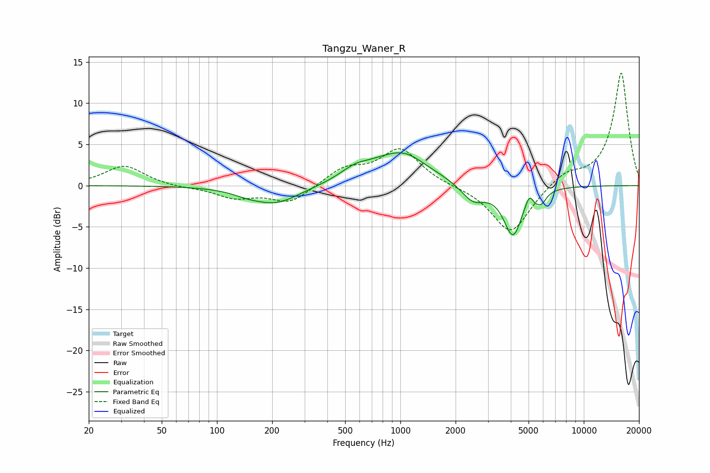

# Tangzu_Waner_R
See [usage instructions](https://github.com/jaakkopasanen/AutoEq#usage) for more options and info.

### Parametric EQs
Apply preamp of -4.1 dB when using parametric equalizer.

|   # | Type    |   Fc (Hz) |    Q |   Gain (dB) |
|-----|---------|-----------|------|-------------|
|   1 | Peaking |       144 | 1.98 |        -0.4 |
|   2 | Peaking |       208 | 1.05 |        -2.2 |
|   3 | Peaking |       565 | 1.76 |         1.2 |
|   4 | Peaking |       984 | 0.9  |         3.8 |
|   5 | Peaking |      1110 | 2.77 |         0.2 |
|   6 | Peaking |      2495 | 2.15 |        -2.1 |
|   7 | Peaking |      4112 | 2.76 |        -6   |
|   8 | Peaking |      5066 | 5.99 |         1.5 |
|   9 | Peaking |      5406 | 6    |        -0.8 |
|  10 | Peaking |      5889 | 5.33 |        -1.2 |

### Fixed Band EQs
When using fixed band (also called graphic) equalizer, apply preamp of **-13.7 dB** (if available) and set gains manually with these parameters.

|   # | Type    |   Fc (Hz) |    Q |   Gain (dB) |
|-----|---------|-----------|------|-------------|
|   1 | Peaking |        31 | 1.41 |         2.4 |
|   2 | Peaking |        62 | 1.41 |        -0.2 |
|   3 | Peaking |       125 | 1.41 |        -1.4 |
|   4 | Peaking |       250 | 1.41 |        -2.1 |
|   5 | Peaking |       500 | 1.41 |         2   |
|   6 | Peaking |      1000 | 1.41 |         4.4 |
|   7 | Peaking |      2000 | 1.41 |        -0.1 |
|   8 | Peaking |      4000 | 1.41 |        -5.9 |
|   9 | Peaking |      8000 | 1.41 |         1.5 |
|  10 | Peaking |     16000 | 1.41 |        13.7 |

### Graphs

