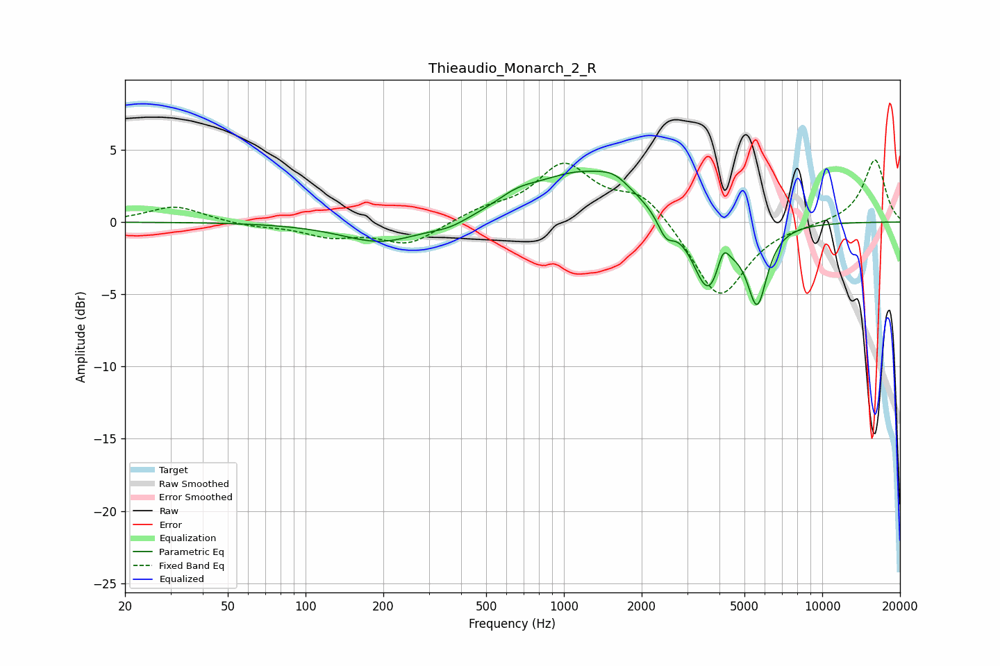

# Thieaudio_Monarch_2_R
See [usage instructions](https://github.com/jaakkopasanen/AutoEq#usage) for more options and info.

### Parametric EQs
Apply preamp of -3.6 dB when using parametric equalizer.

|   # | Type    |   Fc (Hz) |    Q |   Gain (dB) |
|-----|---------|-----------|------|-------------|
|   1 | Peaking |       197 | 0.92 |        -1.5 |
|   2 | Peaking |       361 | 1.9  |        -0.5 |
|   3 | Peaking |       657 | 1.83 |         0.7 |
|   4 | Peaking |      1181 | 0.71 |         3.4 |
|   5 | Peaking |      1571 | 2.49 |         0.7 |
|   6 | Peaking |      2480 | 4.48 |        -1.4 |
|   7 | Peaking |      3625 | 2.32 |        -5   |
|   8 | Peaking |      4131 | 6    |         1.7 |
|   9 | Peaking |      5596 | 4.41 |         0.7 |
|  10 | Peaking |      5600 | 3.67 |        -5.9 |

### Fixed Band EQs
When using fixed band (also called graphic) equalizer, apply preamp of **-4.4 dB** (if available) and set gains manually with these parameters.

|   # | Type    |   Fc (Hz) |    Q |   Gain (dB) |
|-----|---------|-----------|------|-------------|
|   1 | Peaking |        31 | 1.41 |         1.1 |
|   2 | Peaking |        62 | 1.41 |        -0.3 |
|   3 | Peaking |       125 | 1.41 |        -0.9 |
|   4 | Peaking |       250 | 1.41 |        -1.5 |
|   5 | Peaking |       500 | 1.41 |         0.7 |
|   6 | Peaking |      1000 | 1.41 |         3.8 |
|   7 | Peaking |      2000 | 1.41 |         2   |
|   8 | Peaking |      4000 | 1.41 |        -5.4 |
|   9 | Peaking |      8000 | 1.41 |        -0.1 |
|  10 | Peaking |     16000 | 1.41 |         4.4 |

### Graphs

