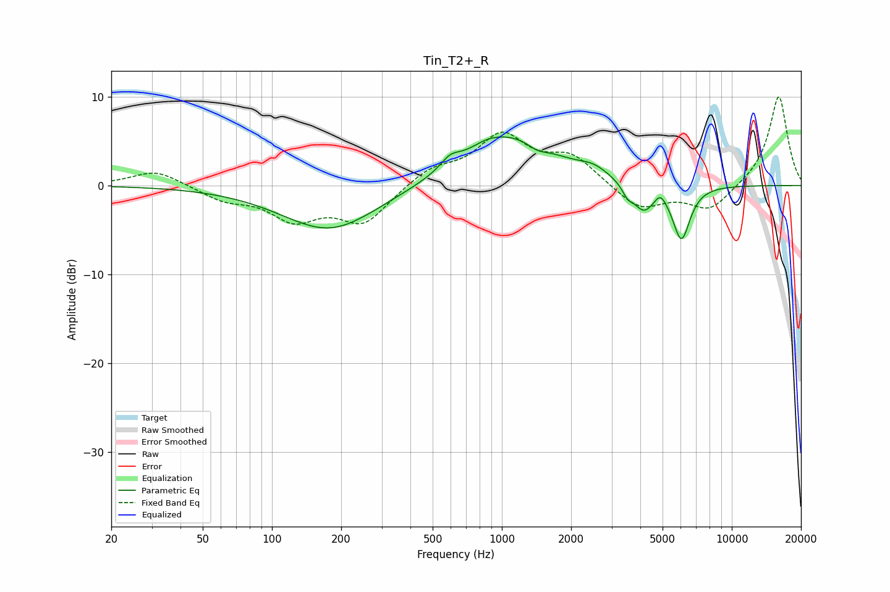

# Tin_T2+_R
See [usage instructions](https://github.com/jaakkopasanen/AutoEq#usage) for more options and info.

### Parametric EQs
Apply preamp of -5.6 dB when using parametric equalizer.

|   # | Type    |   Fc (Hz) |    Q |   Gain (dB) |
|-----|---------|-----------|------|-------------|
|   1 | Peaking |       179 | 0.67 |        -5.1 |
|   2 | Peaking |       595 | 3.45 |         1.2 |
|   3 | Peaking |       858 | 2.17 |         0.5 |
|   4 | Peaking |      1069 | 0.69 |         5.6 |
|   5 | Peaking |      1426 | 3.26 |        -0.7 |
|   6 | Peaking |      2503 | 2.25 |         0.9 |
|   7 | Peaking |      3523 | 6    |        -1.1 |
|   8 | Peaking |      4136 | 2.98 |        -3   |
|   9 | Peaking |      4892 | 6    |         1.1 |
|  10 | Peaking |      6038 | 3.65 |        -6.1 |

### Fixed Band EQs
When using fixed band (also called graphic) equalizer, apply preamp of **-10.1 dB** (if available) and set gains manually with these parameters.

|   # | Type    |   Fc (Hz) |    Q |   Gain (dB) |
|-----|---------|-----------|------|-------------|
|   1 | Peaking |        31 | 1.41 |         1.8 |
|   2 | Peaking |        62 | 1.41 |        -1.5 |
|   3 | Peaking |       125 | 1.41 |        -3.5 |
|   4 | Peaking |       250 | 1.41 |        -4.1 |
|   5 | Peaking |       500 | 1.41 |         1.8 |
|   6 | Peaking |      1000 | 1.41 |         5.4 |
|   7 | Peaking |      2000 | 1.41 |         3.1 |
|   8 | Peaking |      4000 | 1.41 |        -2.8 |
|   9 | Peaking |      8000 | 1.41 |        -2.8 |
|  10 | Peaking |     16000 | 1.41 |        10.2 |

### Graphs

