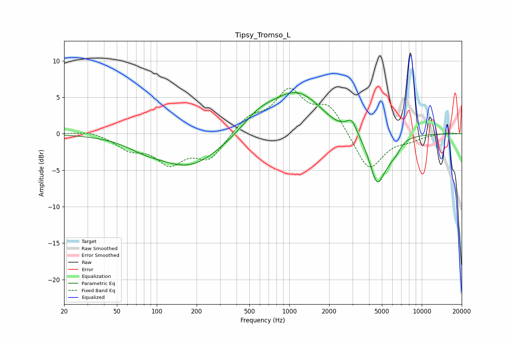

# Tipsy_Tromso_L
See [usage instructions](https://github.com/jaakkopasanen/AutoEq#usage) for more options and info.

### Parametric EQs
Apply preamp of -5.7 dB when using parametric equalizer.

|   # | Type    |   Fc (Hz) |    Q |   Gain (dB) |
|-----|---------|-----------|------|-------------|
|   1 | Peaking |        80 | 1.18 |        -0.8 |
|   2 | Peaking |       177 | 0.57 |        -4.5 |
|   3 | Peaking |       584 | 1.09 |         1.9 |
|   4 | Peaking |      1147 | 0.72 |         5.5 |
|   5 | Peaking |      2184 | 1.62 |        -0.5 |
|   6 | Peaking |      2955 | 3.94 |         1.7 |
|   7 | Peaking |      4585 | 3.09 |         0.4 |
|   8 | Peaking |      4599 | 2.36 |        -7.2 |
|   9 | Peaking |      5668 | 2.96 |        -1.3 |
|  10 | Peaking |      6463 | 4.36 |        -0.9 |

### Fixed Band EQs
When using fixed band (also called graphic) equalizer, apply preamp of **-6.3 dB** (if available) and set gains manually with these parameters.

|   # | Type    |   Fc (Hz) |    Q |   Gain (dB) |
|-----|---------|-----------|------|-------------|
|   1 | Peaking |        31 | 1.41 |         0.5 |
|   2 | Peaking |        62 | 1.41 |        -1.8 |
|   3 | Peaking |       125 | 1.41 |        -3.7 |
|   4 | Peaking |       250 | 1.41 |        -3.3 |
|   5 | Peaking |       500 | 1.41 |         2.1 |
|   6 | Peaking |      1000 | 1.41 |         5.5 |
|   7 | Peaking |      2000 | 1.41 |         3.7 |
|   8 | Peaking |      4000 | 1.41 |        -5.3 |
|   9 | Peaking |      8000 | 1.41 |        -0.7 |
|  10 | Peaking |     16000 | 1.41 |         0.2 |

### Graphs

