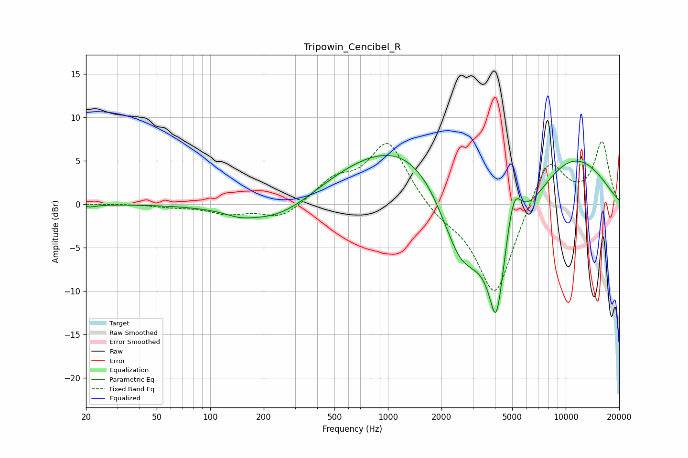

# Tripowin_Cencibel_R
See [usage instructions](https://github.com/jaakkopasanen/AutoEq#usage) for more options and info.

### Parametric EQs
Apply preamp of -5.7 dB when using parametric equalizer.

|   # | Type    |   Fc (Hz) |    Q |   Gain (dB) |
|-----|---------|-----------|------|-------------|
|   1 | Peaking |        21 | 3.75 |        -0.3 |
|   2 | Peaking |       146 | 1.89 |        -0.5 |
|   3 | Peaking |       242 | 0.67 |        -2.8 |
|   4 | Peaking |       787 | 0.39 |         3.1 |
|   5 | Peaking |      1950 | 0.43 |         8.4 |
|   6 | Peaking |      2531 | 1.02 |       -10   |
|   7 | Peaking |      4069 | 3.8  |        -7.8 |
|   8 | Peaking |      4348 | 0.72 |       -10.9 |
|   9 | Peaking |      5099 | 2.96 |         6.5 |
|  10 | Peaking |     10000 | 0.48 |         6.8 |

### Fixed Band EQs
When using fixed band (also called graphic) equalizer, apply preamp of **-7.3 dB** (if available) and set gains manually with these parameters.

|   # | Type    |   Fc (Hz) |    Q |   Gain (dB) |
|-----|---------|-----------|------|-------------|
|   1 | Peaking |        31 | 1.41 |         0   |
|   2 | Peaking |        62 | 1.41 |        -0.3 |
|   3 | Peaking |       125 | 1.41 |        -1   |
|   4 | Peaking |       250 | 1.41 |        -1.7 |
|   5 | Peaking |       500 | 1.41 |         2.4 |
|   6 | Peaking |      1000 | 1.41 |         7.2 |
|   7 | Peaking |      2000 | 1.41 |        -1.2 |
|   8 | Peaking |      4000 | 1.41 |       -10.9 |
|   9 | Peaking |      8000 | 1.41 |         5.9 |
|  10 | Peaking |     16000 | 1.41 |         7.1 |

### Graphs

