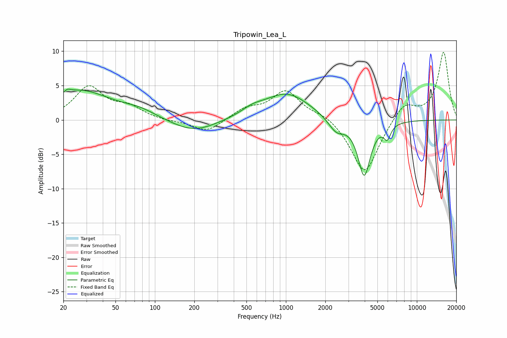

# Tripowin_Lea_L
See [usage instructions](https://github.com/jaakkopasanen/AutoEq#usage) for more options and info.

### Parametric EQs
Apply preamp of -4.6 dB when using parametric equalizer.

|   # | Type    |   Fc (Hz) |    Q |   Gain (dB) |
|-----|---------|-----------|------|-------------|
|   1 | Peaking |        21 | 6    |        -3   |
|   2 | Peaking |        21 | 5.86 |         3.3 |
|   3 | Peaking |        26 | 0.57 |         4.2 |
|   4 | Peaking |        77 | 1.1  |         0.9 |
|   5 | Peaking |       197 | 0.83 |        -1.9 |
|   6 | Peaking |       554 | 1.67 |         0.9 |
|   7 | Peaking |      1018 | 0.81 |         3.9 |
|   8 | Peaking |      2424 | 2.24 |        -2   |
|   9 | Peaking |      3960 | 2.93 |        -8.1 |
|  10 | Peaking |      5941 | 5.24 |        -2   |

### Fixed Band EQs
When using fixed band (also called graphic) equalizer, apply preamp of **-9.9 dB** (if available) and set gains manually with these parameters.

|   # | Type    |   Fc (Hz) |    Q |   Gain (dB) |
|-----|---------|-----------|------|-------------|
|   1 | Peaking |        31 | 1.41 |         4.7 |
|   2 | Peaking |        62 | 1.41 |         1.6 |
|   3 | Peaking |       125 | 1.41 |        -0.2 |
|   4 | Peaking |       250 | 1.41 |        -1.8 |
|   5 | Peaking |       500 | 1.41 |         1.5 |
|   6 | Peaking |      1000 | 1.41 |         4.1 |
|   7 | Peaking |      2000 | 1.41 |         0.9 |
|   8 | Peaking |      4000 | 1.41 |        -8   |
|   9 | Peaking |      8000 | 1.41 |         2.6 |
|  10 | Peaking |     16000 | 1.41 |         9.9 |

### Graphs

