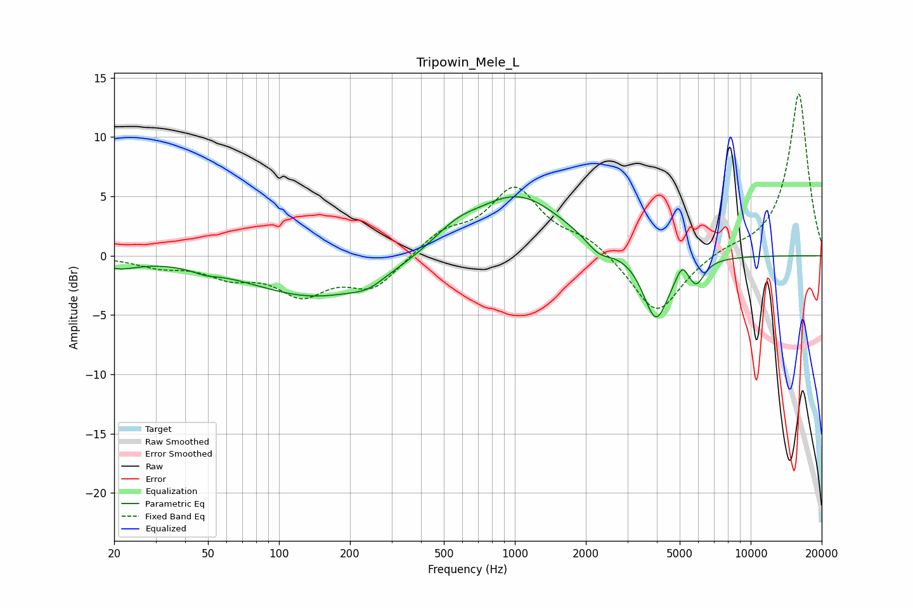

# Tripowin_Mele_L
See [usage instructions](https://github.com/jaakkopasanen/AutoEq#usage) for more options and info.

### Parametric EQs
Apply preamp of -5.1 dB when using parametric equalizer.

|   # | Type    |   Fc (Hz) |    Q |   Gain (dB) |
|-----|---------|-----------|------|-------------|
|   1 | Peaking |        21 | 1.83 |        -0.8 |
|   2 | Peaking |        49 | 2.8  |        -0.3 |
|   3 | Peaking |       147 | 0.49 |        -3.5 |
|   4 | Peaking |       238 | 2.15 |        -0.6 |
|   5 | Peaking |       559 | 1.46 |         1.3 |
|   6 | Peaking |      1026 | 0.72 |         5.1 |
|   7 | Peaking |      2272 | 2.57 |        -1.2 |
|   8 | Peaking |      3969 | 2.54 |        -5.6 |
|   9 | Peaking |      5123 | 6    |         1.1 |
|  10 | Peaking |      5881 | 4.13 |        -1.9 |

### Fixed Band EQs
When using fixed band (also called graphic) equalizer, apply preamp of **-13.7 dB** (if available) and set gains manually with these parameters.

|   # | Type    |   Fc (Hz) |    Q |   Gain (dB) |
|-----|---------|-----------|------|-------------|
|   1 | Peaking |        31 | 1.41 |        -0.8 |
|   2 | Peaking |        62 | 1.41 |        -1.5 |
|   3 | Peaking |       125 | 1.41 |        -3   |
|   4 | Peaking |       250 | 1.41 |        -2.6 |
|   5 | Peaking |       500 | 1.41 |         1.8 |
|   6 | Peaking |      1000 | 1.41 |         5.5 |
|   7 | Peaking |      2000 | 1.41 |         1.3 |
|   8 | Peaking |      4000 | 1.41 |        -5.1 |
|   9 | Peaking |      8000 | 1.41 |         0.5 |
|  10 | Peaking |     16000 | 1.41 |        13.8 |

### Graphs

