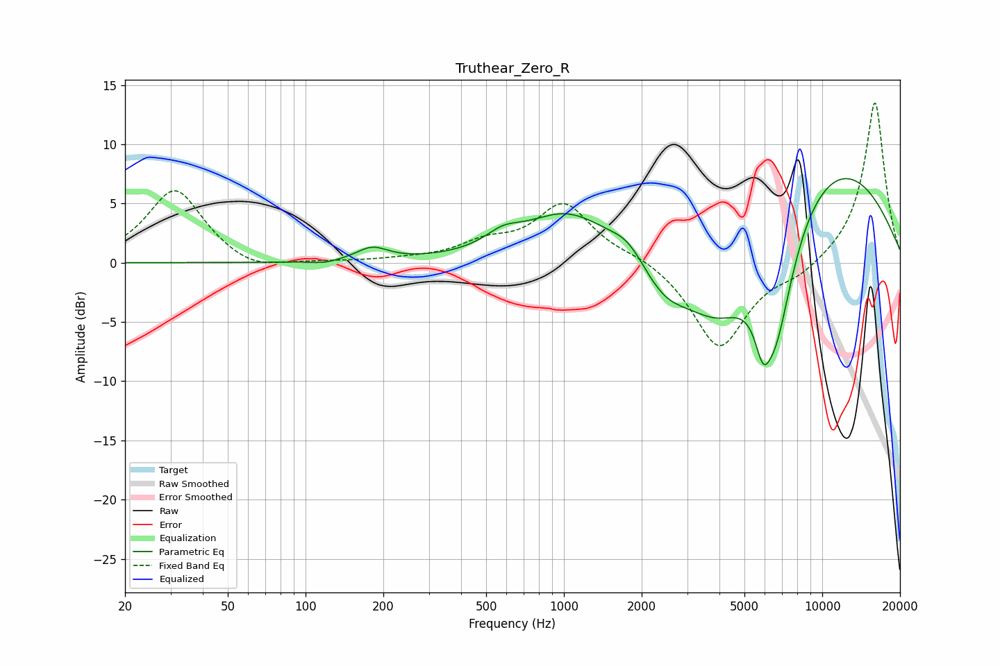

# Truthear_Zero_R
See [usage instructions](https://github.com/jaakkopasanen/AutoEq#usage) for more options and info.

### Parametric EQs
Apply preamp of -7.2 dB when using parametric equalizer.

|   # | Type    |   Fc (Hz) |    Q |   Gain (dB) |
|-----|---------|-----------|------|-------------|
|   1 | Peaking |       119 | 2.7  |        -0.3 |
|   2 | Peaking |       181 | 2.32 |         1.1 |
|   3 | Peaking |       581 | 2.07 |         1.1 |
|   4 | Peaking |      1034 | 0.82 |         4.1 |
|   5 | Peaking |      1780 | 2.01 |         1.5 |
|   6 | Peaking |      2434 | 1.4  |        -2.9 |
|   7 | Peaking |      3956 | 0.94 |        -6.7 |
|   8 | Peaking |      5889 | 4.66 |        -3.1 |
|   9 | Peaking |      6577 | 1.77 |       -10.6 |
|  10 | Peaking |     10000 | 0.36 |         9.2 |

### Fixed Band EQs
When using fixed band (also called graphic) equalizer, apply preamp of **-13.6 dB** (if available) and set gains manually with these parameters.

|   # | Type    |   Fc (Hz) |    Q |   Gain (dB) |
|-----|---------|-----------|------|-------------|
|   1 | Peaking |        31 | 1.41 |         6.2 |
|   2 | Peaking |        62 | 1.41 |        -1   |
|   3 | Peaking |       125 | 1.41 |         0   |
|   4 | Peaking |       250 | 1.41 |         0.2 |
|   5 | Peaking |       500 | 1.41 |         1.4 |
|   6 | Peaking |      1000 | 1.41 |         4.9 |
|   7 | Peaking |      2000 | 1.41 |         0.6 |
|   8 | Peaking |      4000 | 1.41 |        -7.3 |
|   9 | Peaking |      8000 | 1.41 |        -1   |
|  10 | Peaking |     16000 | 1.41 |        13.7 |

### Graphs

