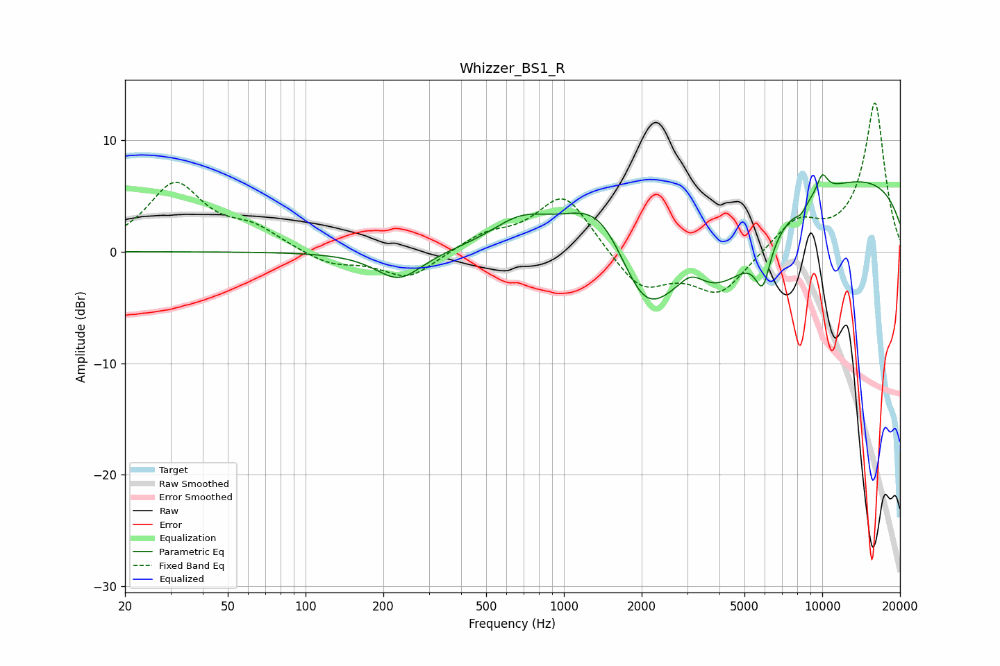

# Whizzer_BS1_R
See [usage instructions](https://github.com/jaakkopasanen/AutoEq#usage) for more options and info.

### Parametric EQs
Apply preamp of -7.0 dB when using parametric equalizer.

|   # | Type    |   Fc (Hz) |    Q |   Gain (dB) |
|-----|---------|-----------|------|-------------|
|   1 | Peaking |       230 | 1.57 |        -2.6 |
|   2 | Peaking |       681 | 1.21 |         2.3 |
|   3 | Peaking |      1391 | 1.05 |         5.3 |
|   4 | Peaking |      2040 | 1.23 |        -7.3 |
|   5 | Peaking |      3104 | 2.83 |         1.5 |
|   6 | Peaking |      4039 | 0.72 |        -7.8 |
|   7 | Peaking |      5886 | 4.69 |        -3.9 |
|   8 | Peaking |      8254 | 5.94 |        -0.7 |
|   9 | Peaking |     10000 | 5.68 |         1.7 |
|  10 | Peaking |     10000 | 0.18 |         7.3 |

### Fixed Band EQs
When using fixed band (also called graphic) equalizer, apply preamp of **-13.4 dB** (if available) and set gains manually with these parameters.

|   # | Type    |   Fc (Hz) |    Q |   Gain (dB) |
|-----|---------|-----------|------|-------------|
|   1 | Peaking |        31 | 1.41 |         5.9 |
|   2 | Peaking |        62 | 1.41 |         1.8 |
|   3 | Peaking |       125 | 1.41 |        -1.2 |
|   4 | Peaking |       250 | 1.41 |        -2.4 |
|   5 | Peaking |       500 | 1.41 |         1.4 |
|   6 | Peaking |      1000 | 1.41 |         5.3 |
|   7 | Peaking |      2000 | 1.41 |        -3.5 |
|   8 | Peaking |      4000 | 1.41 |        -3.7 |
|   9 | Peaking |      8000 | 1.41 |         2.7 |
|  10 | Peaking |     16000 | 1.41 |        13.3 |

### Graphs

