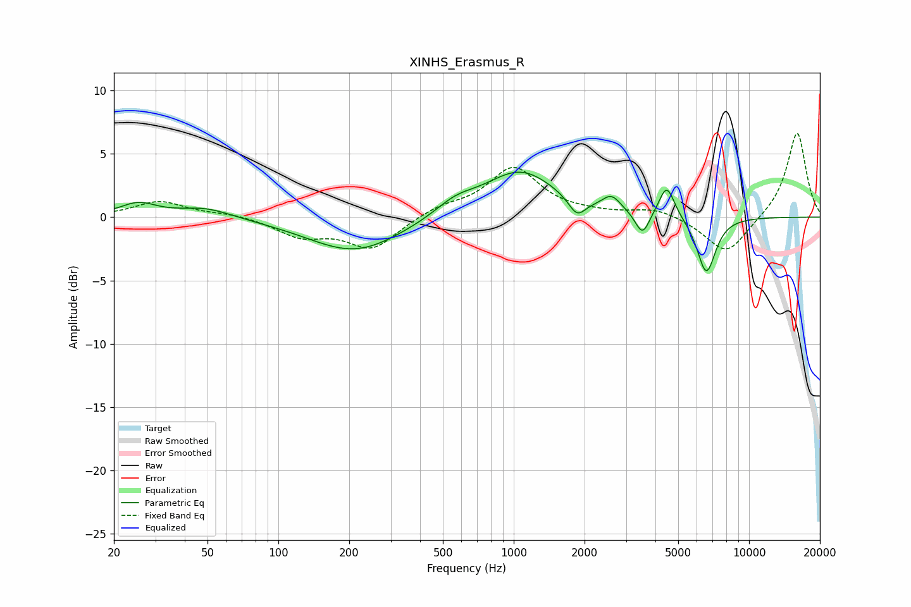

# XINHS_Erasmus_R
See [usage instructions](https://github.com/jaakkopasanen/AutoEq#usage) for more options and info.

### Parametric EQs
Apply preamp of -3.6 dB when using parametric equalizer.

|   # | Type    |   Fc (Hz) |    Q |   Gain (dB) |
|-----|---------|-----------|------|-------------|
|   1 | Peaking |        25 | 1.82 |         1   |
|   2 | Peaking |        49 | 1.25 |         0.8 |
|   3 | Peaking |       212 | 0.71 |        -2.8 |
|   4 | Peaking |       566 | 1.59 |         1   |
|   5 | Peaking |      1065 | 0.92 |         3.6 |
|   6 | Peaking |      1856 | 3.91 |        -1.4 |
|   7 | Peaking |      2604 | 3.56 |         1.2 |
|   8 | Peaking |      3524 | 4.69 |        -1.9 |
|   9 | Peaking |      4470 | 4.2  |         2.6 |
|  10 | Peaking |      6583 | 3.44 |        -4.5 |

### Fixed Band EQs
When using fixed band (also called graphic) equalizer, apply preamp of **-6.7 dB** (if available) and set gains manually with these parameters.

|   # | Type    |   Fc (Hz) |    Q |   Gain (dB) |
|-----|---------|-----------|------|-------------|
|   1 | Peaking |        31 | 1.41 |         1.2 |
|   2 | Peaking |        62 | 1.41 |         0.3 |
|   3 | Peaking |       125 | 1.41 |        -1.4 |
|   4 | Peaking |       250 | 1.41 |        -2.5 |
|   5 | Peaking |       500 | 1.41 |         0.8 |
|   6 | Peaking |      1000 | 1.41 |         3.8 |
|   7 | Peaking |      2000 | 1.41 |         0.2 |
|   8 | Peaking |      4000 | 1.41 |         0.7 |
|   9 | Peaking |      8000 | 1.41 |        -3   |
|  10 | Peaking |     16000 | 1.41 |         6.8 |

### Graphs

