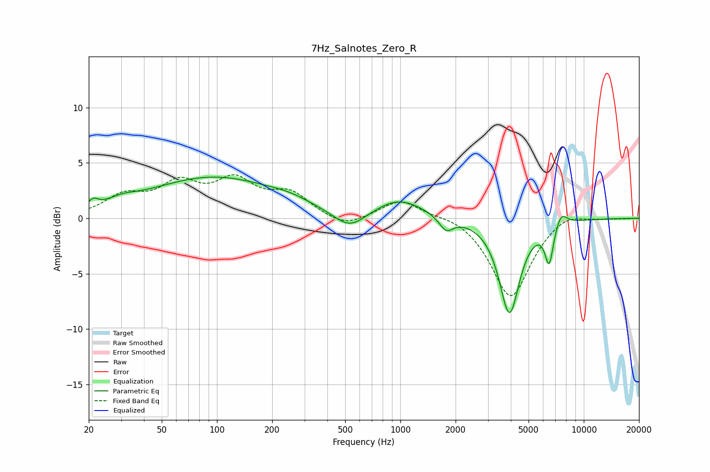

# 7Hz_Salnotes_Zero_R
See [usage instructions](https://github.com/jaakkopasanen/AutoEq#usage) for more options and info.

### Parametric EQs
Apply preamp of -3.8 dB when using parametric equalizer.

|   # | Type    |   Fc (Hz) |    Q |   Gain (dB) |
|-----|---------|-----------|------|-------------|
|   1 | Peaking |        21 | 5.64 |         0.7 |
|   2 | Peaking |        30 | 1.81 |         0.5 |
|   3 | Peaking |        96 | 0.39 |         3.7 |
|   4 | Peaking |       248 | 1.35 |         0.4 |
|   5 | Peaking |       529 | 1.57 |        -1.7 |
|   6 | Peaking |       987 | 1.04 |         1.7 |
|   7 | Peaking |      1777 | 3.68 |        -1.3 |
|   8 | Peaking |      3932 | 2.53 |        -8.5 |
|   9 | Peaking |      6475 | 5.99 |        -3.5 |
|  10 | Peaking |      7525 | 4.3  |         1.2 |

### Fixed Band EQs
When using fixed band (also called graphic) equalizer, apply preamp of **-4.0 dB** (if available) and set gains manually with these parameters.

|   # | Type    |   Fc (Hz) |    Q |   Gain (dB) |
|-----|---------|-----------|------|-------------|
|   1 | Peaking |        31 | 1.41 |         1.8 |
|   2 | Peaking |        62 | 1.41 |         2.7 |
|   3 | Peaking |       125 | 1.41 |         3   |
|   4 | Peaking |       250 | 1.41 |         2   |
|   5 | Peaking |       500 | 1.41 |        -1   |
|   6 | Peaking |      1000 | 1.41 |         1.7 |
|   7 | Peaking |      2000 | 1.41 |         0.4 |
|   8 | Peaking |      4000 | 1.41 |        -7.2 |
|   9 | Peaking |      8000 | 1.41 |         0.8 |
|  10 | Peaking |     16000 | 1.41 |        -0   |

### Graphs

