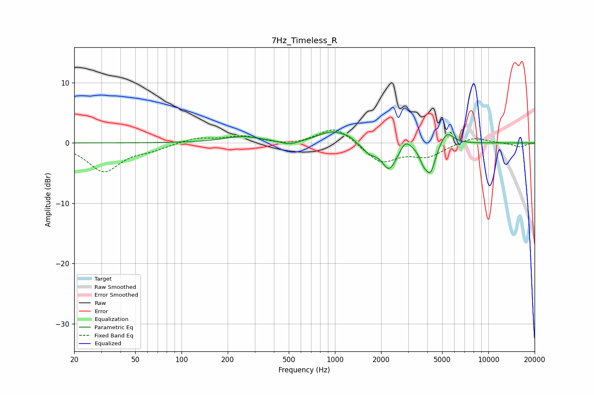

# 7Hz_Timeless_R
See [usage instructions](https://github.com/jaakkopasanen/AutoEq#usage) for more options and info.

### Parametric EQs
Apply preamp of -1.9 dB when using parametric equalizer.

|   # | Type    |   Fc (Hz) |    Q |   Gain (dB) |
|-----|---------|-----------|------|-------------|
|   1 | Peaking |       250 | 1.12 |         1   |
|   2 | Peaking |       506 | 2.49 |        -0.7 |
|   3 | Peaking |       961 | 1.55 |         1.9 |
|   4 | Peaking |      1227 | 3.66 |         0.5 |
|   5 | Peaking |      1675 | 3.1  |        -1.4 |
|   6 | Peaking |      2260 | 2.93 |        -4.3 |
|   7 | Peaking |      2886 | 4.21 |         1.6 |
|   8 | Peaking |      3763 | 5.77 |        -1.6 |
|   9 | Peaking |      4190 | 4.19 |        -4.7 |
|  10 | Peaking |      5351 | 3.23 |         2.3 |

### Fixed Band EQs
When using fixed band (also called graphic) equalizer, apply preamp of **-2.3 dB** (if available) and set gains manually with these parameters.

|   # | Type    |   Fc (Hz) |    Q |   Gain (dB) |
|-----|---------|-----------|------|-------------|
|   1 | Peaking |        31 | 1.41 |        -4.7 |
|   2 | Peaking |        62 | 1.41 |        -0.9 |
|   3 | Peaking |       125 | 1.41 |         0.9 |
|   4 | Peaking |       250 | 1.41 |         1.1 |
|   5 | Peaking |       500 | 1.41 |        -0.5 |
|   6 | Peaking |      1000 | 1.41 |         2.8 |
|   7 | Peaking |      2000 | 1.41 |        -3.3 |
|   8 | Peaking |      4000 | 1.41 |        -2.1 |
|   9 | Peaking |      8000 | 1.41 |         1.1 |
|  10 | Peaking |     16000 | 1.41 |        -0.7 |

### Graphs

