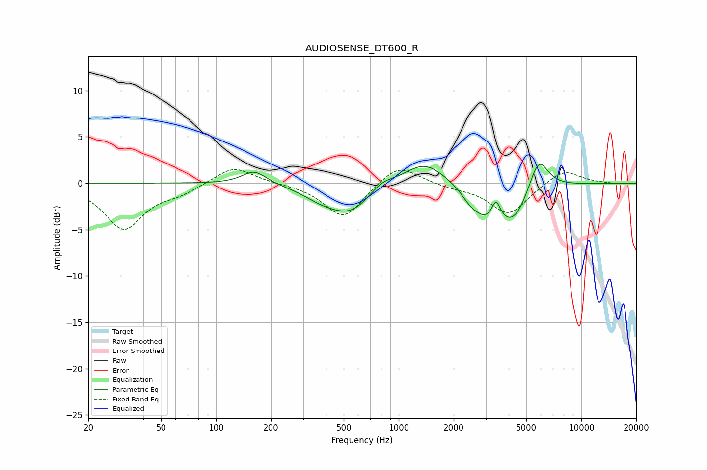

# AUDIOSENSE_DT600_R
See [usage instructions](https://github.com/jaakkopasanen/AutoEq#usage) for more options and info.

### Parametric EQs
Apply preamp of -2.1 dB when using parametric equalizer.

|   # | Type    |   Fc (Hz) |    Q |   Gain (dB) |
|-----|---------|-----------|------|-------------|
|   1 | Peaking |       162 | 2.13 |         1.5 |
|   2 | Peaking |       368 | 1.53 |        -0.8 |
|   3 | Peaking |       542 | 1.12 |        -3.2 |
|   4 | Peaking |       800 | 2.07 |         1   |
|   5 | Peaking |      1385 | 1.25 |         2.5 |
|   6 | Peaking |      2447 | 3.16 |        -0.8 |
|   7 | Peaking |      2959 | 1.91 |        -2.6 |
|   8 | Peaking |      3412 | 6    |         2   |
|   9 | Peaking |      4229 | 1.58 |        -4   |
|  10 | Peaking |      5825 | 2.58 |         3.9 |

### Fixed Band EQs
When using fixed band (also called graphic) equalizer, apply preamp of **-1.6 dB** (if available) and set gains manually with these parameters.

|   # | Type    |   Fc (Hz) |    Q |   Gain (dB) |
|-----|---------|-----------|------|-------------|
|   1 | Peaking |        31 | 1.41 |        -4.9 |
|   2 | Peaking |        62 | 1.41 |        -0.9 |
|   3 | Peaking |       125 | 1.41 |         1.9 |
|   4 | Peaking |       250 | 1.41 |        -0   |
|   5 | Peaking |       500 | 1.41 |        -3.8 |
|   6 | Peaking |      1000 | 1.41 |         2.2 |
|   7 | Peaking |      2000 | 1.41 |        -0.4 |
|   8 | Peaking |      4000 | 1.41 |        -3.4 |
|   9 | Peaking |      8000 | 1.41 |         1.6 |
|  10 | Peaking |     16000 | 1.41 |        -0.1 |

### Graphs

