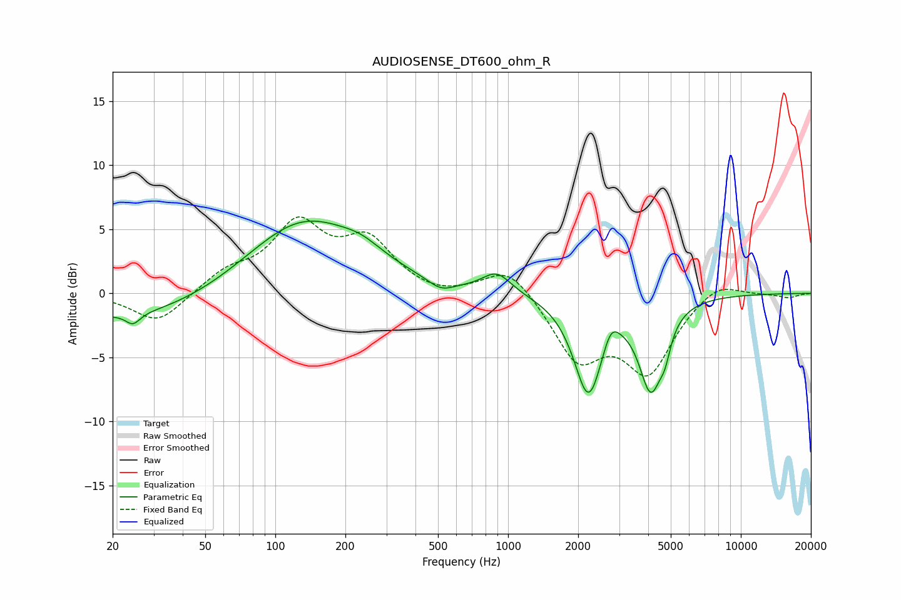

# AUDIOSENSE_DT600_ohm_R
See [usage instructions](https://github.com/jaakkopasanen/AutoEq#usage) for more options and info.

### Parametric EQs
Apply preamp of -5.7 dB when using parametric equalizer.

|   # | Type    |   Fc (Hz) |    Q |   Gain (dB) |
|-----|---------|-----------|------|-------------|
|   1 | Peaking |        24 | 4.81 |        -0.8 |
|   2 | Peaking |        25 | 0.36 |        -2.2 |
|   3 | Peaking |       132 | 0.57 |         5.9 |
|   4 | Peaking |       235 | 1.62 |         0.8 |
|   5 | Peaking |       515 | 2.42 |        -0.9 |
|   6 | Peaking |       895 | 2.31 |         1.6 |
|   7 | Peaking |      2216 | 2.27 |        -7.7 |
|   8 | Peaking |      2763 | 4.12 |         1.6 |
|   9 | Peaking |      4104 | 2.74 |        -6.7 |
|  10 | Peaking |      4721 | 5.97 |        -1.5 |

### Fixed Band EQs
When using fixed band (also called graphic) equalizer, apply preamp of **-6.1 dB** (if available) and set gains manually with these parameters.

|   # | Type    |   Fc (Hz) |    Q |   Gain (dB) |
|-----|---------|-----------|------|-------------|
|   1 | Peaking |        31 | 1.41 |        -2.4 |
|   2 | Peaking |        62 | 1.41 |         1.5 |
|   3 | Peaking |       125 | 1.41 |         5.1 |
|   4 | Peaking |       250 | 1.41 |         3.8 |
|   5 | Peaking |       500 | 1.41 |        -0.4 |
|   6 | Peaking |      1000 | 1.41 |         2.3 |
|   7 | Peaking |      2000 | 1.41 |        -4.9 |
|   8 | Peaking |      4000 | 1.41 |        -5.8 |
|   9 | Peaking |      8000 | 1.41 |         1.2 |
|  10 | Peaking |     16000 | 1.41 |        -0.3 |

### Graphs

