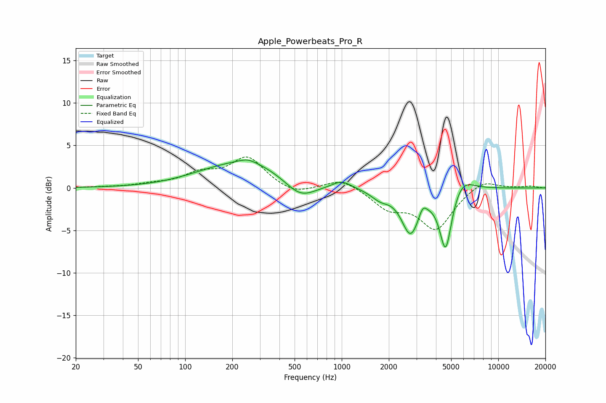

# Apple_Powerbeats_Pro_R
See [usage instructions](https://github.com/jaakkopasanen/AutoEq#usage) for more options and info.

### Parametric EQs
Apply preamp of -3.4 dB when using parametric equalizer.

|   # | Type    |   Fc (Hz) |    Q |   Gain (dB) |
|-----|---------|-----------|------|-------------|
|   1 | Peaking |       135 | 0.75 |         0.6 |
|   2 | Peaking |       252 | 2.81 |         0.4 |
|   3 | Peaking |       259 | 0.62 |         2.9 |
|   4 | Peaking |       543 | 1.42 |        -2.1 |
|   5 | Peaking |       999 | 2.35 |         0.9 |
|   6 | Peaking |      1758 | 2.44 |        -1   |
|   7 | Peaking |      2751 | 2.47 |        -5.1 |
|   8 | Peaking |      3289 | 6    |         1.1 |
|   9 | Peaking |      4612 | 3.58 |        -7.2 |
|  10 | Peaking |      5854 | 1.95 |         1.8 |

### Fixed Band EQs
When using fixed band (also called graphic) equalizer, apply preamp of **-3.7 dB** (if available) and set gains manually with these parameters.

|   # | Type    |   Fc (Hz) |    Q |   Gain (dB) |
|-----|---------|-----------|------|-------------|
|   1 | Peaking |        31 | 1.41 |         0.1 |
|   2 | Peaking |        62 | 1.41 |         0.3 |
|   3 | Peaking |       125 | 1.41 |         1.5 |
|   4 | Peaking |       250 | 1.41 |         3.5 |
|   5 | Peaking |       500 | 1.41 |        -0.9 |
|   6 | Peaking |      1000 | 1.41 |         1.2 |
|   7 | Peaking |      2000 | 1.41 |        -2.2 |
|   8 | Peaking |      4000 | 1.41 |        -4.7 |
|   9 | Peaking |      8000 | 1.41 |         1.1 |
|  10 | Peaking |     16000 | 1.41 |         0.2 |

### Graphs

