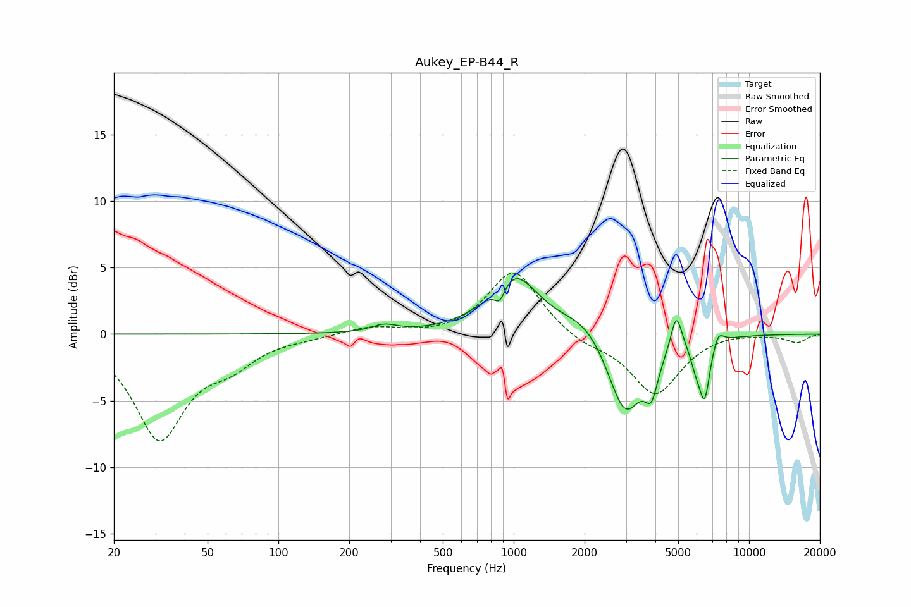

# Aukey_EP-B44_R
See [usage instructions](https://github.com/jaakkopasanen/AutoEq#usage) for more options and info.

### Parametric EQs
Apply preamp of -4.3 dB when using parametric equalizer.

|   # | Type    |   Fc (Hz) |    Q |   Gain (dB) |
|-----|---------|-----------|------|-------------|
|   1 | Peaking |       282 | 2.66 |         0.5 |
|   2 | Peaking |       873 | 6    |        -1.3 |
|   3 | Peaking |       997 | 1.37 |         4.5 |
|   4 | Peaking |      2028 | 1.39 |         1.4 |
|   5 | Peaking |      2972 | 1.89 |        -6.2 |
|   6 | Peaking |      3848 | 4.95 |        -2.7 |
|   7 | Peaking |      4911 | 6    |         2.8 |
|   8 | Peaking |      5940 | 6    |        -1.3 |
|   9 | Peaking |      6473 | 5.94 |        -4.3 |
|  10 | Peaking |      7393 | 6    |         1   |

### Fixed Band EQs
When using fixed band (also called graphic) equalizer, apply preamp of **-4.7 dB** (if available) and set gains manually with these parameters.

|   # | Type    |   Fc (Hz) |    Q |   Gain (dB) |
|-----|---------|-----------|------|-------------|
|   1 | Peaking |        31 | 1.41 |        -7.7 |
|   2 | Peaking |        62 | 1.41 |        -1.7 |
|   3 | Peaking |       125 | 1.41 |        -0.2 |
|   4 | Peaking |       250 | 1.41 |         0.6 |
|   5 | Peaking |       500 | 1.41 |        -0.2 |
|   6 | Peaking |      1000 | 1.41 |         4.9 |
|   7 | Peaking |      2000 | 1.41 |        -0.7 |
|   8 | Peaking |      4000 | 1.41 |        -4.5 |
|   9 | Peaking |      8000 | 1.41 |         0.2 |
|  10 | Peaking |     16000 | 1.41 |        -0.6 |

### Graphs

