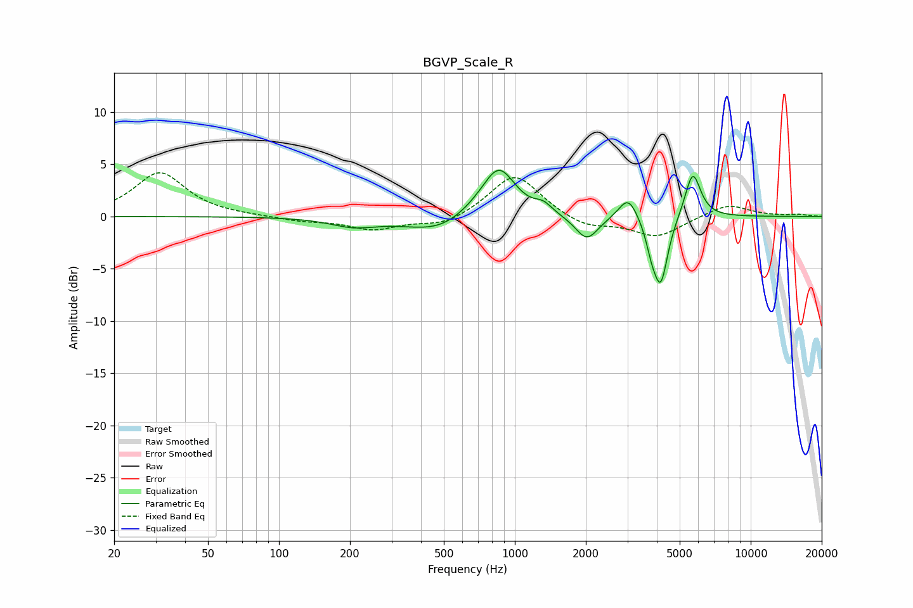

# BGVP_Scale_R
See [usage instructions](https://github.com/jaakkopasanen/AutoEq#usage) for more options and info.

### Parametric EQs
Apply preamp of -4.5 dB when using parametric equalizer.

|   # | Type    |   Fc (Hz) |    Q |   Gain (dB) |
|-----|---------|-----------|------|-------------|
|   1 | Peaking |       207 | 1.46 |        -0.8 |
|   2 | Peaking |       485 | 0.99 |        -1.7 |
|   3 | Peaking |       717 | 1.35 |         1   |
|   4 | Peaking |       859 | 2.07 |         4.3 |
|   5 | Peaking |      1322 | 3.88 |         0.8 |
|   6 | Peaking |      2020 | 2.89 |        -2.4 |
|   7 | Peaking |      3025 | 3.54 |         2.2 |
|   8 | Peaking |      3795 | 6    |        -1.8 |
|   9 | Peaking |      4155 | 4.6  |        -6.3 |
|  10 | Peaking |      5680 | 4.2  |         4.4 |

### Fixed Band EQs
When using fixed band (also called graphic) equalizer, apply preamp of **-4.3 dB** (if available) and set gains manually with these parameters.

|   # | Type    |   Fc (Hz) |    Q |   Gain (dB) |
|-----|---------|-----------|------|-------------|
|   1 | Peaking |        31 | 1.41 |         4.2 |
|   2 | Peaking |        62 | 1.41 |         0   |
|   3 | Peaking |       125 | 1.41 |        -0.4 |
|   4 | Peaking |       250 | 1.41 |        -1.2 |
|   5 | Peaking |       500 | 1.41 |        -0.9 |
|   6 | Peaking |      1000 | 1.41 |         4.2 |
|   7 | Peaking |      2000 | 1.41 |        -1.1 |
|   8 | Peaking |      4000 | 1.41 |        -1.9 |
|   9 | Peaking |      8000 | 1.41 |         1.2 |
|  10 | Peaking |     16000 | 1.41 |         0.2 |

### Graphs

