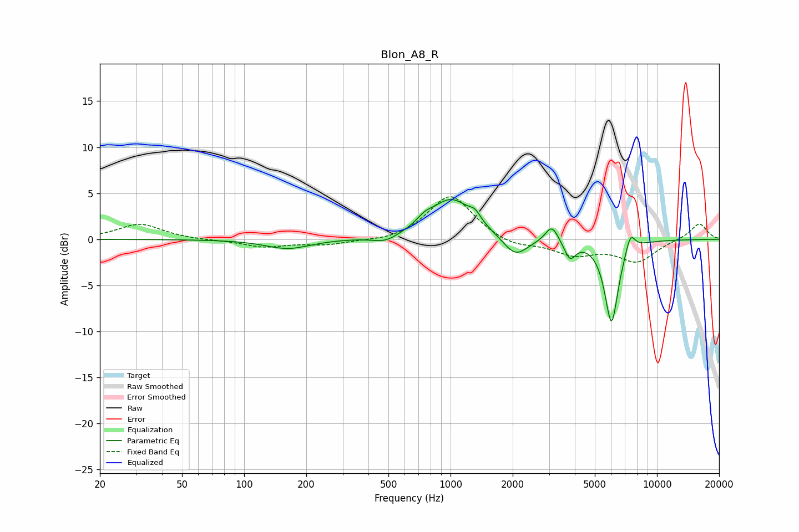

# Blon_A8_R
See [usage instructions](https://github.com/jaakkopasanen/AutoEq#usage) for more options and info.

### Parametric EQs
Apply preamp of -4.4 dB when using parametric equalizer.

|   # | Type    |   Fc (Hz) |    Q |   Gain (dB) |
|-----|---------|-----------|------|-------------|
|   1 | Peaking |       163 | 1.31 |        -1   |
|   2 | Peaking |       483 | 2.28 |        -0.8 |
|   3 | Peaking |       748 | 3.72 |         0.7 |
|   4 | Peaking |      1009 | 1.37 |         4.3 |
|   5 | Peaking |      1314 | 5.29 |         0.9 |
|   6 | Peaking |      2063 | 2.37 |        -2.2 |
|   7 | Peaking |      3097 | 4.55 |         1.8 |
|   8 | Peaking |      3788 | 5.18 |        -1.9 |
|   9 | Peaking |      6023 | 4.13 |        -9.1 |
|  10 | Peaking |      7436 | 5.95 |         2   |

### Fixed Band EQs
When using fixed band (also called graphic) equalizer, apply preamp of **-4.7 dB** (if available) and set gains manually with these parameters.

|   # | Type    |   Fc (Hz) |    Q |   Gain (dB) |
|-----|---------|-----------|------|-------------|
|   1 | Peaking |        31 | 1.41 |         1.7 |
|   2 | Peaking |        62 | 1.41 |        -0.1 |
|   3 | Peaking |       125 | 1.41 |        -0.8 |
|   4 | Peaking |       250 | 1.41 |        -0.6 |
|   5 | Peaking |       500 | 1.41 |        -0.3 |
|   6 | Peaking |      1000 | 1.41 |         4.9 |
|   7 | Peaking |      2000 | 1.41 |        -0.9 |
|   8 | Peaking |      4000 | 1.41 |        -1.6 |
|   9 | Peaking |      8000 | 1.41 |        -2.3 |
|  10 | Peaking |     16000 | 1.41 |         1.8 |

### Graphs

