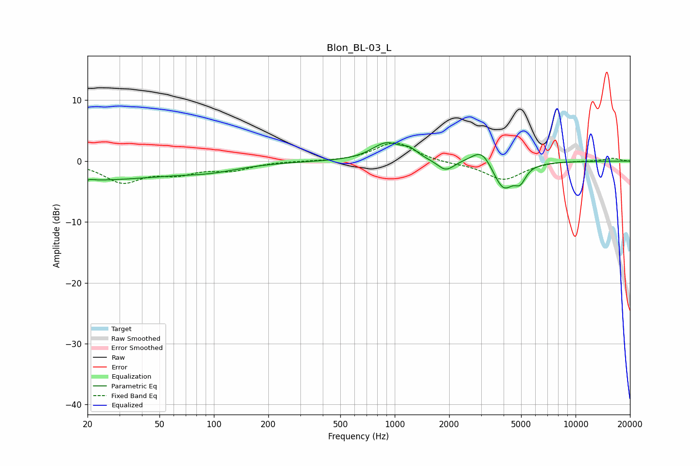

# Blon_BL-03_L
See [usage instructions](https://github.com/jaakkopasanen/AutoEq#usage) for more options and info.

### Parametric EQs
Apply preamp of -3.1 dB when using parametric equalizer.

|   # | Type    |   Fc (Hz) |    Q |   Gain (dB) |
|-----|---------|-----------|------|-------------|
|   1 | Peaking |        20 | 5.83 |        -2.8 |
|   2 | Peaking |        20 | 0.3  |        -3   |
|   3 | Peaking |        20 | 5.99 |         2.8 |
|   4 | Peaking |        96 | 0.85 |        -1   |
|   5 | Peaking |       897 | 1.78 |         2.9 |
|   6 | Peaking |      1210 | 3.22 |         1.2 |
|   7 | Peaking |      1915 | 3.08 |        -1.8 |
|   8 | Peaking |      3037 | 2.48 |         2.8 |
|   9 | Peaking |      3983 | 2.39 |        -4.9 |
|  10 | Peaking |      4948 | 4.75 |        -2.1 |

### Fixed Band EQs
When using fixed band (also called graphic) equalizer, apply preamp of **-3.1 dB** (if available) and set gains manually with these parameters.

|   # | Type    |   Fc (Hz) |    Q |   Gain (dB) |
|-----|---------|-----------|------|-------------|
|   1 | Peaking |        31 | 1.41 |        -3.3 |
|   2 | Peaking |        62 | 1.41 |        -1.7 |
|   3 | Peaking |       125 | 1.41 |        -1.3 |
|   4 | Peaking |       250 | 1.41 |         0   |
|   5 | Peaking |       500 | 1.41 |        -0.1 |
|   6 | Peaking |      1000 | 1.41 |         3.2 |
|   7 | Peaking |      2000 | 1.41 |        -0.3 |
|   8 | Peaking |      4000 | 1.41 |        -3.1 |
|   9 | Peaking |      8000 | 1.41 |         0.1 |
|  10 | Peaking |     16000 | 1.41 |         0.5 |

### Graphs

