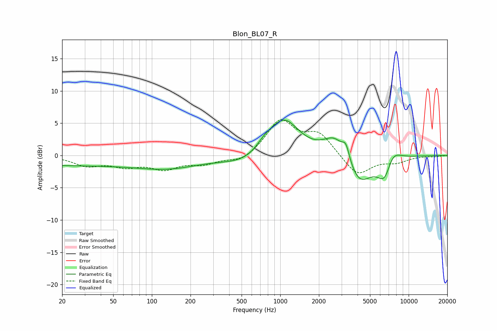

# Blon_BL07_R
See [usage instructions](https://github.com/jaakkopasanen/AutoEq#usage) for more options and info.

### Parametric EQs
Apply preamp of -5.6 dB when using parametric equalizer.

|   # | Type    |   Fc (Hz) |    Q |   Gain (dB) |
|-----|---------|-----------|------|-------------|
|   1 | Peaking |        20 | 0.19 |        -1.5 |
|   2 | Peaking |       138 | 0.61 |        -1.4 |
|   3 | Peaking |       570 | 0.76 |        -1.6 |
|   4 | Peaking |       758 | 2.08 |         1.4 |
|   5 | Peaking |      1069 | 1.2  |         5.8 |
|   6 | Peaking |      2673 | 1.64 |         3.2 |
|   7 | Peaking |      3248 | 5.07 |         2.2 |
|   8 | Peaking |      4115 | 1.43 |        -4.7 |
|   9 | Peaking |      6528 | 2.41 |        -4.1 |
|  10 | Peaking |      7383 | 2.18 |         2.6 |

### Fixed Band EQs
When using fixed band (also called graphic) equalizer, apply preamp of **-5.6 dB** (if available) and set gains manually with these parameters.

|   # | Type    |   Fc (Hz) |    Q |   Gain (dB) |
|-----|---------|-----------|------|-------------|
|   1 | Peaking |        31 | 1.41 |        -1.5 |
|   2 | Peaking |        62 | 1.41 |        -1.4 |
|   3 | Peaking |       125 | 1.41 |        -1.9 |
|   4 | Peaking |       250 | 1.41 |        -1.2 |
|   5 | Peaking |       500 | 1.41 |        -1.1 |
|   6 | Peaking |      1000 | 1.41 |         5.3 |
|   7 | Peaking |      2000 | 1.41 |         3.2 |
|   8 | Peaking |      4000 | 1.41 |        -3.2 |
|   9 | Peaking |      8000 | 1.41 |        -0.9 |
|  10 | Peaking |     16000 | 1.41 |        -0.2 |

### Graphs

