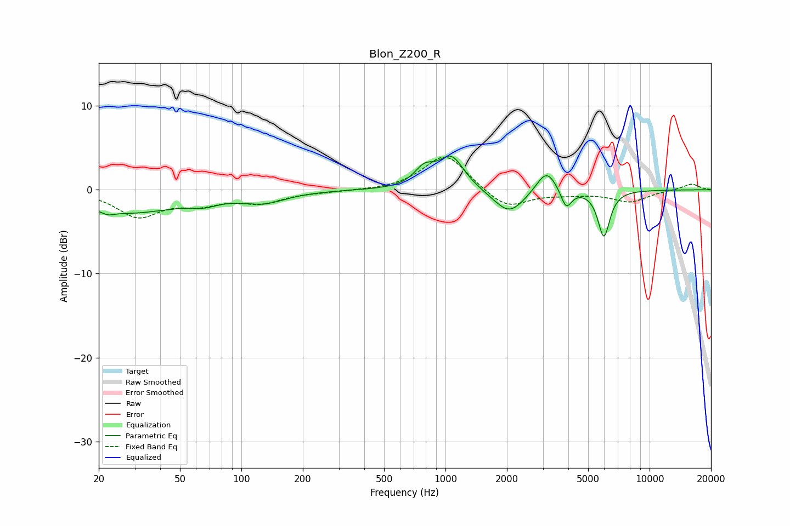

# Blon_Z200_R
See [usage instructions](https://github.com/jaakkopasanen/AutoEq#usage) for more options and info.

### Parametric EQs
Apply preamp of -4.1 dB when using parametric equalizer.

|   # | Type    |   Fc (Hz) |    Q |   Gain (dB) |
|-----|---------|-----------|------|-------------|
|   1 | Peaking |        22 | 4.48 |        -0.5 |
|   2 | Peaking |        28 | 0.56 |        -2.7 |
|   3 | Peaking |        66 | 2.06 |        -0.7 |
|   4 | Peaking |       129 | 1.31 |        -1.3 |
|   5 | Peaking |       788 | 2.91 |         2   |
|   6 | Peaking |      1068 | 2.25 |         3.9 |
|   7 | Peaking |      2053 | 1.84 |        -3   |
|   8 | Peaking |      3127 | 2.82 |         2.8 |
|   9 | Peaking |      3904 | 5.3  |        -2.3 |
|  10 | Peaking |      5973 | 4.76 |        -5.5 |

### Fixed Band EQs
When using fixed band (also called graphic) equalizer, apply preamp of **-4.0 dB** (if available) and set gains manually with these parameters.

|   # | Type    |   Fc (Hz) |    Q |   Gain (dB) |
|-----|---------|-----------|------|-------------|
|   1 | Peaking |        31 | 1.41 |        -3.1 |
|   2 | Peaking |        62 | 1.41 |        -1.4 |
|   3 | Peaking |       125 | 1.41 |        -1.4 |
|   4 | Peaking |       250 | 1.41 |        -0.2 |
|   5 | Peaking |       500 | 1.41 |        -0.1 |
|   6 | Peaking |      1000 | 1.41 |         4.4 |
|   7 | Peaking |      2000 | 1.41 |        -2.3 |
|   8 | Peaking |      4000 | 1.41 |        -0.4 |
|   9 | Peaking |      8000 | 1.41 |        -1.4 |
|  10 | Peaking |     16000 | 1.41 |         0.7 |

### Graphs

