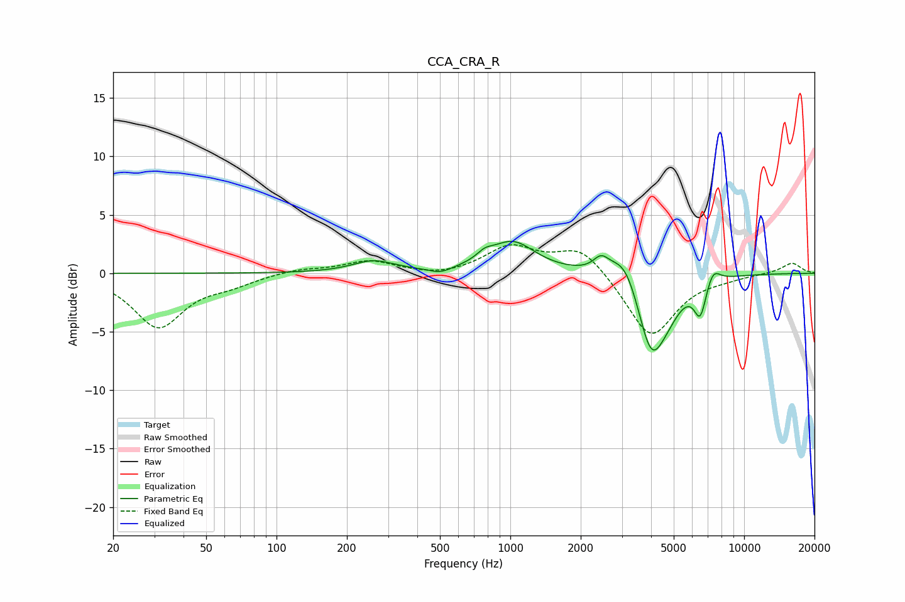

# CCA_CRA_R
See [usage instructions](https://github.com/jaakkopasanen/AutoEq#usage) for more options and info.

### Parametric EQs
Apply preamp of -2.8 dB when using parametric equalizer.

|   # | Type    |   Fc (Hz) |    Q |   Gain (dB) |
|-----|---------|-----------|------|-------------|
|   1 | Peaking |       260 | 1.58 |         1   |
|   2 | Peaking |       502 | 2.97 |        -0.5 |
|   3 | Peaking |       776 | 4.2  |         0.6 |
|   4 | Peaking |      1020 | 1.45 |         2.7 |
|   5 | Peaking |      2444 | 4.3  |         1.1 |
|   6 | Peaking |      3101 | 2.2  |         2.6 |
|   7 | Peaking |      3998 | 2.33 |        -6.6 |
|   8 | Peaking |      4727 | 2.16 |        -1.6 |
|   9 | Peaking |      6494 | 5.22 |        -2.9 |
|  10 | Peaking |      7356 | 4.52 |         1.3 |

### Fixed Band EQs
When using fixed band (also called graphic) equalizer, apply preamp of **-2.5 dB** (if available) and set gains manually with these parameters.

|   # | Type    |   Fc (Hz) |    Q |   Gain (dB) |
|-----|---------|-----------|------|-------------|
|   1 | Peaking |        31 | 1.41 |        -4.5 |
|   2 | Peaking |        62 | 1.41 |        -0.8 |
|   3 | Peaking |       125 | 1.41 |         0.4 |
|   4 | Peaking |       250 | 1.41 |         1   |
|   5 | Peaking |       500 | 1.41 |        -0.3 |
|   6 | Peaking |      1000 | 1.41 |         2.2 |
|   7 | Peaking |      2000 | 1.41 |         2.3 |
|   8 | Peaking |      4000 | 1.41 |        -5.6 |
|   9 | Peaking |      8000 | 1.41 |        -0.3 |
|  10 | Peaking |     16000 | 1.41 |         0.9 |

### Graphs

