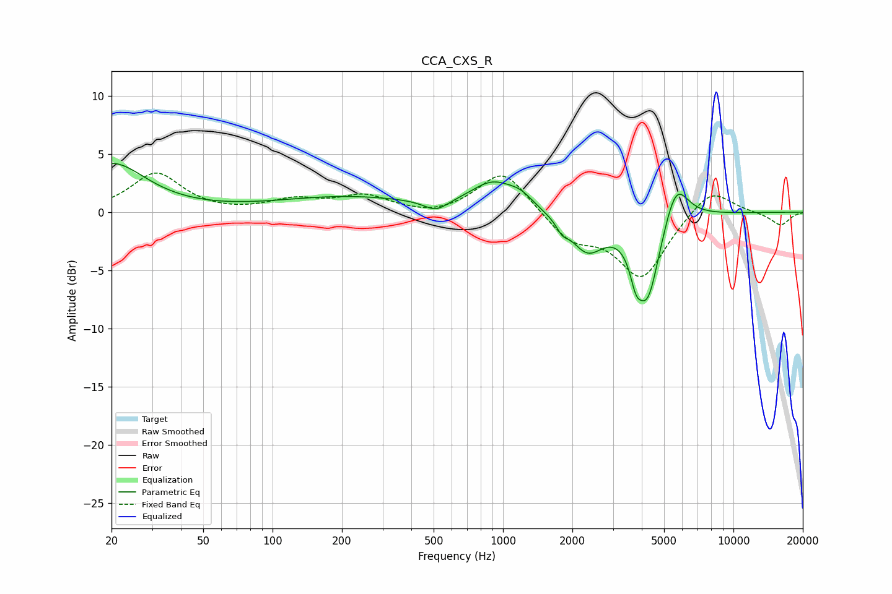

# CCA_CXS_R
See [usage instructions](https://github.com/jaakkopasanen/AutoEq#usage) for more options and info.

### Parametric EQs
Apply preamp of -4.3 dB when using parametric equalizer.

|   # | Type    |   Fc (Hz) |    Q |   Gain (dB) |
|-----|---------|-----------|------|-------------|
|   1 | Peaking |        20 | 0.96 |         4.1 |
|   2 | Peaking |       210 | 0.46 |         1.3 |
|   3 | Peaking |       512 | 2.73 |        -0.9 |
|   4 | Peaking |       905 | 1.45 |         2.4 |
|   5 | Peaking |      1196 | 2.61 |         0.8 |
|   6 | Peaking |      1806 | 5.9  |        -0.8 |
|   7 | Peaking |      2317 | 1.92 |        -3.2 |
|   8 | Peaking |      3769 | 6    |        -1.9 |
|   9 | Peaking |      4233 | 2.57 |        -7.4 |
|  10 | Peaking |      5624 | 2.61 |         3.7 |

### Fixed Band EQs
When using fixed band (also called graphic) equalizer, apply preamp of **-3.5 dB** (if available) and set gains manually with these parameters.

|   # | Type    |   Fc (Hz) |    Q |   Gain (dB) |
|-----|---------|-----------|------|-------------|
|   1 | Peaking |        31 | 1.41 |         3.3 |
|   2 | Peaking |        62 | 1.41 |        -0.1 |
|   3 | Peaking |       125 | 1.41 |         1   |
|   4 | Peaking |       250 | 1.41 |         1.3 |
|   5 | Peaking |       500 | 1.41 |        -0.4 |
|   6 | Peaking |      1000 | 1.41 |         3.7 |
|   7 | Peaking |      2000 | 1.41 |        -2.3 |
|   8 | Peaking |      4000 | 1.41 |        -5.6 |
|   9 | Peaking |      8000 | 1.41 |         2.3 |
|  10 | Peaking |     16000 | 1.41 |        -1.1 |

### Graphs

