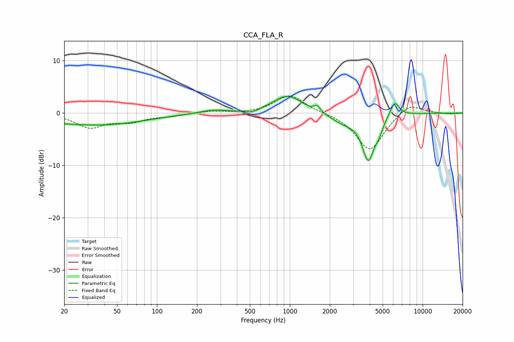

# CCA_FLA_R
See [usage instructions](https://github.com/jaakkopasanen/AutoEq#usage) for more options and info.

### Parametric EQs
Apply preamp of -3.3 dB when using parametric equalizer.

|   # | Type    |   Fc (Hz) |    Q |   Gain (dB) |
|-----|---------|-----------|------|-------------|
|   1 | Peaking |        23 | 0.3  |        -1.7 |
|   2 | Peaking |        48 | 0.53 |        -0.8 |
|   3 | Peaking |       262 | 1.45 |         0.6 |
|   4 | Peaking |       521 | 2.87 |        -0.6 |
|   5 | Peaking |       958 | 1.31 |         3.4 |
|   6 | Peaking |      1606 | 6    |         1.1 |
|   7 | Peaking |      2531 | 1.44 |        -1.6 |
|   8 | Peaking |      3902 | 3.01 |        -8.5 |
|   9 | Peaking |      4691 | 5.09 |        -1.6 |
|  10 | Peaking |      6150 | 4    |         2.9 |

### Fixed Band EQs
When using fixed band (also called graphic) equalizer, apply preamp of **-3.4 dB** (if available) and set gains manually with these parameters.

|   # | Type    |   Fc (Hz) |    Q |   Gain (dB) |
|-----|---------|-----------|------|-------------|
|   1 | Peaking |        31 | 1.41 |        -2.6 |
|   2 | Peaking |        62 | 1.41 |        -1.4 |
|   3 | Peaking |       125 | 1.41 |        -0.5 |
|   4 | Peaking |       250 | 1.41 |         0.4 |
|   5 | Peaking |       500 | 1.41 |        -0.1 |
|   6 | Peaking |      1000 | 1.41 |         3.5 |
|   7 | Peaking |      2000 | 1.41 |         0.1 |
|   8 | Peaking |      4000 | 1.41 |        -7.3 |
|   9 | Peaking |      8000 | 1.41 |         2.1 |
|  10 | Peaking |     16000 | 1.41 |        -0.2 |

### Graphs

