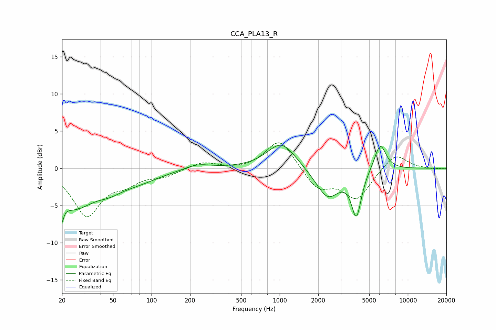

# CCA_PLA13_R
See [usage instructions](https://github.com/jaakkopasanen/AutoEq#usage) for more options and info.

### Parametric EQs
Apply preamp of -3.2 dB when using parametric equalizer.

|   # | Type    |   Fc (Hz) |    Q |   Gain (dB) |
|-----|---------|-----------|------|-------------|
|   1 | Peaking |        20 | 5.96 |        -5.8 |
|   2 | Peaking |        20 | 5.78 |         3.3 |
|   3 | Peaking |        24 | 0.82 |        -4.9 |
|   4 | Peaking |        47 | 1.55 |        -0.9 |
|   5 | Peaking |        75 | 0.76 |        -1.5 |
|   6 | Peaking |       228 | 1.38 |         0.7 |
|   7 | Peaking |      1032 | 1.29 |         3.6 |
|   8 | Peaking |      2369 | 1.52 |        -4   |
|   9 | Peaking |      3969 | 3.64 |        -6   |
|  10 | Peaking |      6081 | 3.01 |         3.6 |

### Fixed Band EQs
When using fixed band (also called graphic) equalizer, apply preamp of **-3.5 dB** (if available) and set gains manually with these parameters.

|   # | Type    |   Fc (Hz) |    Q |   Gain (dB) |
|-----|---------|-----------|------|-------------|
|   1 | Peaking |        31 | 1.41 |        -6.2 |
|   2 | Peaking |        62 | 1.41 |        -1.6 |
|   3 | Peaking |       125 | 1.41 |        -0.9 |
|   4 | Peaking |       250 | 1.41 |         0.9 |
|   5 | Peaking |       500 | 1.41 |        -0.2 |
|   6 | Peaking |      1000 | 1.41 |         4   |
|   7 | Peaking |      2000 | 1.41 |        -2.8 |
|   8 | Peaking |      4000 | 1.41 |        -4   |
|   9 | Peaking |      8000 | 1.41 |         2.1 |
|  10 | Peaking |     16000 | 1.41 |        -0.1 |

### Graphs

