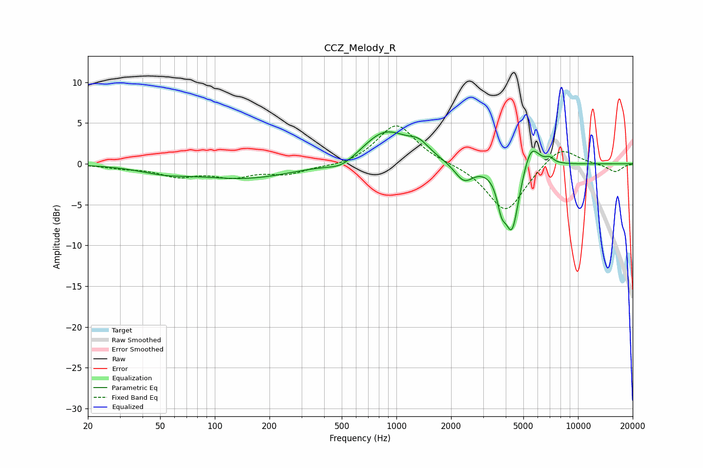

# CCZ_Melody_R
See [usage instructions](https://github.com/jaakkopasanen/AutoEq#usage) for more options and info.

### Parametric EQs
Apply preamp of -4.0 dB when using parametric equalizer.

|   # | Type    |   Fc (Hz) |    Q |   Gain (dB) |
|-----|---------|-----------|------|-------------|
|   1 | Peaking |        53 | 1    |        -0.8 |
|   2 | Peaking |       149 | 0.53 |        -1.7 |
|   3 | Peaking |       502 | 1.75 |        -1.1 |
|   4 | Peaking |       867 | 1.11 |         4.1 |
|   5 | Peaking |      1330 | 2.46 |         1.4 |
|   6 | Peaking |      2354 | 2.72 |        -2.3 |
|   7 | Peaking |      3788 | 6    |        -2.9 |
|   8 | Peaking |      4331 | 3.44 |        -8.2 |
|   9 | Peaking |      5497 | 3.08 |         3.4 |
|  10 | Peaking |      6986 | 6    |         0.6 |

### Fixed Band EQs
When using fixed band (also called graphic) equalizer, apply preamp of **-4.7 dB** (if available) and set gains manually with these parameters.

|   # | Type    |   Fc (Hz) |    Q |   Gain (dB) |
|-----|---------|-----------|------|-------------|
|   1 | Peaking |        31 | 1.41 |        -0.4 |
|   2 | Peaking |        62 | 1.41 |        -1.4 |
|   3 | Peaking |       125 | 1.41 |        -1.4 |
|   4 | Peaking |       250 | 1.41 |        -1.1 |
|   5 | Peaking |       500 | 1.41 |        -0.4 |
|   6 | Peaking |      1000 | 1.41 |         4.9 |
|   7 | Peaking |      2000 | 1.41 |         0   |
|   8 | Peaking |      4000 | 1.41 |        -6   |
|   9 | Peaking |      8000 | 1.41 |         2.4 |
|  10 | Peaking |     16000 | 1.41 |        -1   |

### Graphs

