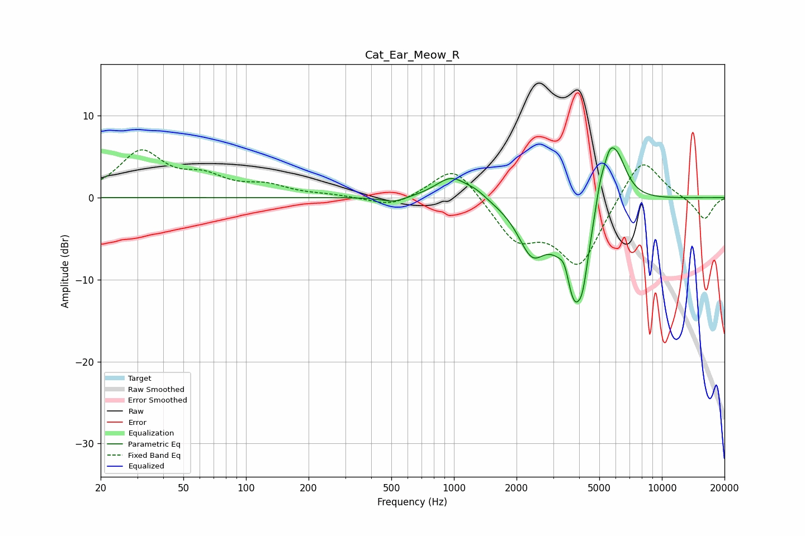

# Cat_Ear_Meow_R
See [usage instructions](https://github.com/jaakkopasanen/AutoEq#usage) for more options and info.

### Parametric EQs
Apply preamp of -6.2 dB when using parametric equalizer.

|   # | Type    |   Fc (Hz) |    Q |   Gain (dB) |
|-----|---------|-----------|------|-------------|
|   1 | Peaking |       515 | 2.39 |        -0.7 |
|   2 | Peaking |       973 | 1.83 |         2.6 |
|   3 | Peaking |      1281 | 2.76 |         0.7 |
|   4 | Peaking |      2369 | 2.09 |        -5.6 |
|   5 | Peaking |      3410 | 5.87 |         2   |
|   6 | Peaking |      3795 | 2.36 |       -12.2 |
|   7 | Peaking |      4171 | 5.99 |        -3   |
|   8 | Peaking |      5045 | 5.79 |         2.6 |
|   9 | Peaking |      5579 | 4.58 |         3.5 |
|  10 | Peaking |      6088 | 2.65 |         5.6 |

### Fixed Band EQs
When using fixed band (also called graphic) equalizer, apply preamp of **-5.9 dB** (if available) and set gains manually with these parameters.

|   # | Type    |   Fc (Hz) |    Q |   Gain (dB) |
|-----|---------|-----------|------|-------------|
|   1 | Peaking |        31 | 1.41 |         5.4 |
|   2 | Peaking |        62 | 1.41 |         2.1 |
|   3 | Peaking |       125 | 1.41 |         1.2 |
|   4 | Peaking |       250 | 1.41 |         0.2 |
|   5 | Peaking |       500 | 1.41 |        -1.2 |
|   6 | Peaking |      1000 | 1.41 |         4.2 |
|   7 | Peaking |      2000 | 1.41 |        -4.8 |
|   8 | Peaking |      4000 | 1.41 |        -8.2 |
|   9 | Peaking |      8000 | 1.41 |         5.5 |
|  10 | Peaking |     16000 | 1.41 |        -2.7 |

### Graphs

